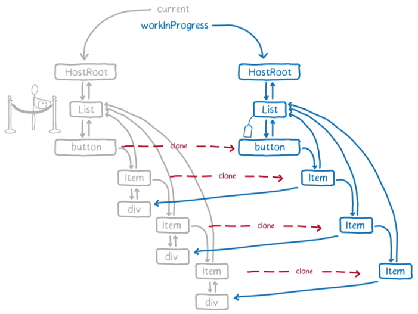
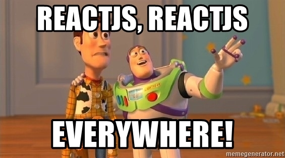
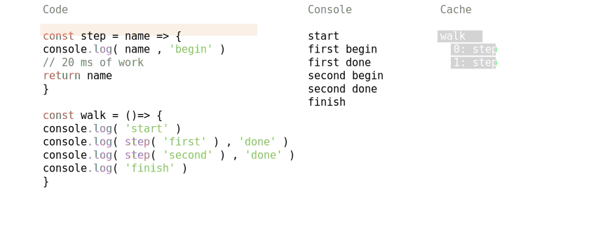
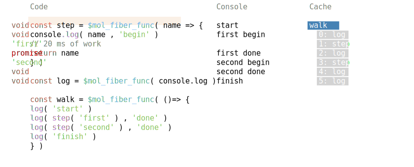
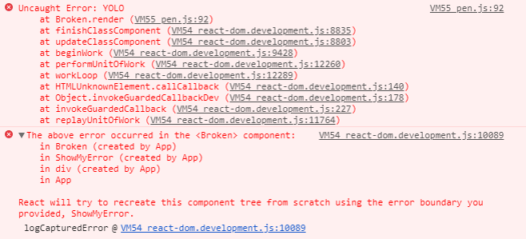

# Quantum Mechanics of Calculations

[Dmitriy Karlovskiy](http://github.com/nin-jin/) @ [HolyJS 2018 Piter](https://holyjs-piter.ru/)

> Это - текстовая версия одноимённого выступления на HolyJS 2018 Piter. Вы можете [читать её как статью](https://github.com/nin-jin/slides/blob/master/fibers/readme.md), либо [открыть в интерфейсе проведения презентаций](https://nin-jin.github.io/slides/fibers/).

> Здравствуйте, меня зовут Дмитрий Карловский, и сегодня я расскажу вам как дробить долгие вычисления на небольшие кванты в полуавтоматическом режиме. Но сперва давайте обозначим проблемы, которые мы будем решать..

# Issue: Low responsiveness

> Если мы хотим стабильные 60 кадров в секунду, то у нас есть всего 16 с мелочью миллисекунд, чтобы выполнить все работы, включая те, что делает браузер, чтобы показать результаты на экране.

1 s / 60 fps ~= 16.(6) ms

> Но что если мы займём поток на большее время? Тогда пользователь будет наблюдать лагающий интерфейс, тормозащую анимацию и тому подобные ухудшения UX.


# Issue: No escape

> Иногда бывает, что пока мы выполняем вычисления, результат их нам уже не интересен. Например, у нас есть виртуальный скролл, пользователь им активно дёргает, но мы не поспеваем за ним и не можем отрендерить актуальную область, пока рендеринг предыдущей не вернёт нам управление, чтобы обработать события пользователя.


> В идеале, какую бы долгую работу мы ни выполняли, мы должны продолжать обрабатывать события и иметь возможность в любой момент отменить начатую, но ещё не законченную работу.

# Issue: No concurrency

> Но что если у нас работа не одна, а несколько, но поток-то один? Представьте, что вы гоните на своём Феррари, подъезжаете к ЖД переезду. Когда он свободен, вы можете проскочить его за долю секунды, но когда он занят километровым составом, вам приходится стоять и ждать несколько минут, пока он освободится. 


> А как было бы классно, если бы этот составм был разбит на 10 составов по 100 метров! Вы бы тогда не так уж сильно и задержались.

> Итак, какие сейчас существуют решения этих проблем в мире JS?

# Solution: Workers

> Первое, что приходит на ум: а давайте мы просто вынесем все сложные вычисления в отдельный поток? Для этого у нас есть механизм WebWorker-ов.


> События из UI-потока передаются в воркер. Там они обрабатываются и обратно уже передаются инструкции, что и как изменить на странице. Таким образом мы избавляем UI поток от большого пласта вычислений, но проблемы таким образом решаются не все, и кроме того добавляются новые.

# Workers: Issues: (De)Serialization

> Общение между потоками происходит посредством посылки сообщений, которые сериализуются в поток байт, передаются в другой поток, а там парсятся в объекты. Всё это гораздо медленнней, чем прямой вызов метода в рамках одного потока.

# Workers: Issues: Asynchronous only

> Сообщения передаются строго асинхронно. А это значит, что некоторые возможности вам попросу недоступны. Например, вы не можете остановить всплытие ui-события из воркера, так как к моменту запуска обработчика, событие в UI-потоке уже завершит свой жизненный цикл.

# Workers: Issues: Limited API’s

> В воркерах нам не доступны следующие API..

- DOM, CSSOM
- Canvas
- GeoLocation
- History & Location
- Sync http requests
- XMLHttpRequest.responseXML
- Window

# Workers: Issues: Can’t cancel

> И опять же, у нас нет возможности остановить вычисления в вокере. 


> Да, мы можем остановить весь воркер, но это остановит все задачи в нём.
> Да, можно каждую задачу запускать в отдельном воркере, но это очень ресурсоёмко.

# Solution: React Fiber

> Наверняка многие слышали, как FaceBook героически переписал React, разбив все вычисления в нём на кучу мелких функций, запускающихся специальным планировщиком.



> Я не буду вдаваться в детали его реализации, так как это отдельная большая тема. Отмечу лишь некоторые особенности, из-за которых он возможно вам не подойдёт..

# React Fiber: React required

> Очевидно, если вы используете Angular, Vue или другой фреймворк отличный от React, то React Fiber для вас бесполезен.



# React Fiber: Only rendering

> React - покрывает лишь слой рендеринга. Все остальные слои приложения остаются без какого-либо квантования.


> React Fiber не спасёт вас, когда нужно, например, отфильтровать большой блок данных по хитрым условиям.

# React Fiber: Quantization is disabled

> Не смотря на заявленную поддержку, она до сих пор выключена по умолчанию, так как ломает обратную совместимость.


> Квантование в React всё ещё является экспериментальной штукой. Будьте осторожны!

# React Fiber: Debug is pain

> При включении квантования, callstack перестаёт соответствовать вашему коду, что существенно усложняет отладку. Но к этому вопросу мы ещё вернёмся.


# Solution: quantization

> Давайте попробуем обобщить подход React Fiber так, чтобы избавиться от упомянутых недостатков. Мы хотим оставаться в рамках одного потока, но разбивать долгие вычисления на небольшие кванты, между которыми браузер может отрендерить уже внесённые на страницу изменения, а мы отреагировать на события.


> Сверху вы видите долгое вычисление, которое остановило весь мир более чем на 100мс. А снизу - то же самое вычисление, но разбитое на кванты времени по примерно 16мс, что дало в среднем 60 кадров в секунду. Поскольку мы как правило не знаем сколько именно по времени займут вычисления, мы не можем заранее вручную разбить его на кусочки по 16мс. поэтому нам нужен какой-то рантайм механизм, отмеряющий время выполнения задачи и при превышении размера кванта, ставящий её на паузу до следующего фрейма анимации. Давайте подумаем, какие у нас есть механизмы для реализации таких вот приостанавливаемых задач..

# Concurrency: fibers – stackfull coroutines

> В таких языках как Go и D есть такая идиома как "сопрограмма со стеком", она же "файбер" или "волокно". 

```typescript
import { Future } from 'node-fibers'

const one = ()=> Future.wait( future => setTimeout( future.return ) )

const two = ()=> one() + 1
const three = ()=> two() + 1
const four = ()=> three() + 1

Future.task( four ).detach()
```

> В примере кода вы видите функцию `one`, которая умеет приостанавливать текущий файбер, но сама при этом имеет вполне себе синхронный интерфейс. Функции `two`, `three` и `four` - обычные синхронные функции, которые ничего не знают про файберы. В них вы можете использовать все возможности яваскрипта по полной программе. И, наконец, на последней строке мы просто запускаем функцию `four` в отдельном файбере.

> Использовать файберы довольно удобно, но для их поддержки нужна поддержка рантайма, которой нет у большинства JS интерпретаторов. Однако, для NodeJS есть нативное расширение `node-fibers`, добавляющее эту поддержку. К сожалению, ни в одном браузере файберы не доступны.

# Concurrency: FSM – stackless coroutines

> В таких языках как C# и теперь уже JS есть поддержка "бесстековых сопрограмм" или "асинхронных функций". Такие функции представляют из себя под капотом конечный автомат и ничего не знают про стек, поэтому их приходится помечать специальным ключевым словом "async", а места, где они могут приостанавливаться - "await".

```typescript
const one = ()=> new Promise( done => setTimeout( done ) )

const two = async ()=> ( await one() ) + 1
const three = async ()=> ( await two() ) + 1
const four = async ()=> ( await three() ) + 1

four()
```

> Так как нам может потребоваться отложить вычисление в любой момент, то получается, что асинхронными придётся сделать чуть ли не вообще все функции в приложении. Это мало того, что усложнение кода, так ещё и сильно бьёт по производительности. Кроме того, многие API, принимающие колбэки, всё ещё не поддерживают асинхронные колбэки. Яркий пример - метод `reduce`, любого массива.

# Concurrency: semi-fibers - restarts

> Давайте попробуем сделать что-то похожее на файберы, используя лишь те возможности, что доступны нам в любом современном браузере..

```typescript
import { $mol_fiber_async , $mol_fiber_start } from 'mol_fiber/web'

const one = ()=> $mol_fiber_async( back => setTimeout( back ) )

const two = ()=> one() + 1
const three = ()=> two() + 1
const four = ()=> three() + 1

$mol_fiber_start( four )
```

> Как можно заметить, промежуточные функции ничего не знают про прерывание - это обычный JS. Только функция `one` знает про возможность приостановки. Чтобы прервать вычисление она просто кидает `Promise` в качестве исключения. На последней строке мы запускаем функцию `four` в отдельном псевдофайбере, который отслеживает брошенные внутри исключения и если ему прилетает `Promise`, то подписывается на его `resolve`, чтобы потом перезапустить файбер.

# Figures

> Чтобы показать, как работают псевдофайберы, давайте возьмём не хитрый код..


> Давайте представим, что функция `step` у нас пишет что-то в консоль и делает ещё какую-то тяжёлую работу на 20мс. А функция `walk` дважды вызывает `step`, логируя весь процесс. По середине будет показываться, что сейчас выводится в консоль. А справа - состояние дерева псевдофайберов.

# $mol_fiber: no quantization

> Давайте запустим этот код и посмотрим, что происходит..



> Пока что всё просто и очевидно. Дерево псевдофайберов, конечно, не задействовано. И всё бы хорошо, но этот код исполняется более 40 мс, что никуда не годится.

# $mol_fiber: cache first

> Завернём обе функции в специальную обёртку, запускающую её в псевдофайбере и посмотрим, что происходит..


> Тут стоит обратить внимание на то, что для каждого места вызова функции `one` внутри файбера `walk`, был создан отдельный файбер. Результат первого вызова был закеширован, а вот вместо второго был брошен `Promise`, так как мы исчерпали наш квант фремени.

# $mol_fiber: cache second

> Брошенный в первом фрейме `Promise` будет автоматически зарезолвлен в следующем, что приведёт к перезапуску файбера `walk`..


> Как можно заметить, из-за перезапуска мы вновь вывели в консоль "start" и "first done", но вот "first begin" уже нет, так как он находится в файбере, с заполненным ранее кешом, из-за чего его хендлер более не вызывается. Когда же заполняется кэш файбера `walk` все вложенные файберы уничтожаются, так как к ним исполнение уже никогда не дойдёт.

> Так почему `first begin` вывелся один раз, а `first done` - два? Всё дело в идемпотентности. `console.log` - неидемпотентная операция, сколько раз её вызовешь, столько раз она добавит запись в консоль. А вот файбер, исполняющий в другом файбере, - идемпотентен, он исполняет хендлен лишь при первом вызове, а при последующих сразу возвращает результат из кеша, не приводя ни к каким доволнительным побочным действиям.

# $mol_fiber: idempotence first

> Давайте завернём `console.log` в файбер, тем самым сделав её идемпотентной, и посмотрим, как поведёт себя программа..



> Как видите, теперь в дереве файберов у нас появились записи для каждого вызова функции `log`.

# $mol_fiber: idempotence second

> При следующем перезапуске файбера `walk`, повторные вызовы функции `log` уже не приводят к вызовам настоящей `console.log`, но как только мы доходим до исполнения файберов с незаполненным кешом, то вызовы `console.log` возобновляются.


> Обратите внимание, что в консоли у нас теперь не выводится ничего лишнего - ровно то, что выводилось бы в синхронном коде без каких-либо файберов и квантификации.

# $mol_fiber: break

> Как происходит прерывание вычисления? В начале кванта устанавливается дедлайн. А перед запуском каждого файбера проверяется, не достигли ли мы его. И если достигли, то бросается `Promise`, который резолвится уже в следующем фрейме и начинает новый квант..

```typescript
if( Date.now() > $mol_fiber.deadline ) {
	throw new Promise( $mol_fiber.schedule )
}
```

# $mol_fiber: deadline

> Дедлайн для кванта устанавливается просто. К текущему времени прибавляется 8 миллисекунд. Почему именно 8, ведь на подготовку кадра есть целых 16? Дело в том, что мы не знаем заранее сколько времени потребуется браузеру для рендеринга, поэтому надо оставить некоторое время для его работы. Но порой бывает, что браузеру ничего рендерить не надо, и тогда при 8мс квантах мы можем всунуть ещё один квант в тот же кадр, что даст плотную упаковку квантов с минимальным простоем процессора.

```typescript
const now = Date.now()

const quant = 8

const elapsed = Math.max( 0 , now - $mol_fiber.deadline )
const resistance = Math.min( elapsed , 1000 ) / 10 // 0 .. 100 ms

$mol_fiber.deadline = now + quant + resistence
```

> Но если мы будем просто кидать исключение каждые 8мс, то отладка со включённой остановкой на исключениях превратится в маленький филиал ада. Нам нужен какой-то механизм для детектирования этого режима отладчика. К сожалению, понять это можно лишь косвенно: человеку, чтобы понять продолжать ли исполнение или нет, требуется время порядка секунды. А это значит, что если управление не возвращалось скрипту продолжительное время, то либо была остановка отладчика, либо было тяжёлое вычисление. Чтобы усидеть на обоих стульях мы добавляем ко кванту 10% от прошедшего времени, но не более 100 мс. Это не сильно влияет на FPS, зато на порядок снижает частоту остановки отладчика из-за квантования. 

# Debug: try/catch

> Раз уж речь зашла об отладке, то как вы думаете в каком месте этого кода остановится отладчик?

```typescript
function foo() {
	throw new Error( 'Something wrong' ) // [1]
}

try {
	foo()
} catch( error ) {
	handle( error )
	throw error // [2]
} 
```

> Как правило нужно, чтобы он останавливался там, где исключение бросается первый раз, но реальность такова, что он останавливается лишь там, где оно было брошено последний раз, что как правило весьма далеко от места его возникновения. Поэтому, чтобы не усложнять отладку, исключения никогда не должны перехватываться, через try-catch. Но и совсем без обработки исключений нельзя.

# Debug: unhandled events

> Обычно рантайм предоставляет глобальное событие, которое возникает для каждого неперехваченного исключения..

```typescript
function foo() {
	throw new Error( 'Something wrong' )
}

window.addEventListener( 'error' , event => handle( event.error ) )

foo()
```

> Помимо громоздкости, у этого решения есть такой недостаток, что сюда валятся вообще все исключения и довольно сложно понять из какого файбера и файбера ли возникло событие.

# Debug: Promise

> Наилучшим решением для обработки исключений являются обещания..

```typescript
function foo() {
	throw new Error( 'Something wrong' )
}

new Promise( ()=> {
	foo()
} ).catch( error => handle( error ) ) 
```

> Переданная в Promise функция вызывается тут же, синхронно, но исключение не перехватывается и благополучно останавливает отладчик в месте его возникновения. Чуть позже, асинхронно уже вызывает обработчик ошибки, в котором мы точно знаем какой именно файбер дал сбой и какой именно сбой. Именно такой механизм и используется в $mol_fiber.

# Stack trace: React Fiber

> Давайте взглянем на стектрейс, который вы получаете в Rect Fiber..



> Как можно заметить, мы получаем много кишочков Реакта. Из полезного тут только точка возникновения исключения и имена компонент выше по иерархии. Не густо.

# Stack trace: $mol_fiber

> В $mol_fiber мы получаем куда более полезный стектрейс: никаких кишок, только конкретные точки в прикладном коде, через которые он пришёл к исключению.


> Достигается это за счёт использования нативного стека, обещаниям и автоматическому удалению кишок при логировании. При желании вы можете развернуть ошибку в консоли, как на скриншоте, и увидеть кишки, но там ничего интересного.

# $mol_fiber: handle 

> Итак, для прерывания кванта кидается Promise..

```typescript
limit() {
	if( Date.now() > $mol_fiber.deadline ) {
		throw new Promise( $mol_fiber.schedule )
	}
	// ...
}
```

> Но, как можно догадаться, Promise может быть совершенно любой - файберу совершенно не важно черго ждать, следующего фрейма или завершения загрузки данных..

```typescript
fail( error : Error ) {
	if( error instanceof Promise ) {
		const listener = ()=> self.start()
		return error.then( listener , listener )
	}
	// ...
}
```

> Файбер просто подписывается на resolve обещания и перезапускается. Но вручную кидать и ловить обещания нет необходимости, ведь в комполект входят несколько полезных обёртов..

# $mol_fiber: functions

> Чтобы превратить любую функцию в идемпотентный файбер достаточно завернёть её в $mol_fiber_func..

```typescript
import { $mol_fiber_func as fiberize } from 'mol_fiber/web'

const log = fiberize( console.log )

export const main = fiber( ()=> {
	log( getData( 'goo.gl' ).data )
} ) 
```

# $mol_fiber: promises

```typescript
import { $mol_fiber_sync as sync } from 'mol_fiber/web'

export const getData = sync( fetch )
```

# $mol_fiber: methods

```typescript
import { $mol_fiber_method as action } from 'mol_fiber/web'

export class Mover {

	@action
	move() {
		sendData( 'ya.ru' , getData( 'goo.gl' ) )
	}

} 
```

# $mol_fiber: cancel request

```typescript
import { $mol_fiber_async as async } from 'mol_fiber/web'

function getData( uri : string ) : XMLHttpRequest {
	return async( back => {
		const xhr = new XMLHttpRequest()

		xhr.onload = back( event => {
			if( Math.floor( xhr.status / 100 ) === 2 ) return xhr
			throw new Error( xhr.statusText )
		} )

		xhr.open( 'GET', uri )
		xhr.send()
		
		return ()=> xhr.abort()
	} )
}
```

# $mol_fiber: cancel response

```typescript
import { $mol_fiber_func as fiberize , $mol_fiber_make as Fiber } from 'mol_fiber'

const hash = fiberize( longHashFunc )

const middle_fiber = middleware => ( req , res ) => {
	const fiber = Fiber( ()=> middleware( req , res ) )
	req.on( 'close' , ()=> fiber.destructor() )
	fiber.start()
}

app.get( '/hash/:data/:count' , middle_fiber( ( req , res ) => {
	let data = req.params.data
	for( let i = 0 ; i < req.params.count ; ++ i ) data = hash( data )
	res.end( data )
} ) )
```

# $mol_fiber: concurrency


# $mol_fiber: properties

Pros:
- Runtime support isn’t required
- Can be cancelled at any time
- High FPS
- Concurrent execution
- Usefull stack trace
- ~ 3KB gzipped

Cons:
- Required instrumentation
- All code should be idempotent
- Longer total execution

# $mol_fiber: links

- [nin-jin.github.io/slides/fibers/](https://nin-jin.github.io/slides/fibers/) - this slides
- [mol.js.org/fiber](http://mol.js.org/fiber) - $mol_fiber online demo
- [github.com/eigenmethod/mol/tree/master/fiber](https://github.com/eigenmethod/mol/tree/master/fiber) - $mol_fiber documentation
- [t.me/mam_mol](https://t.me/mam_mol) - lovely $mol chat
