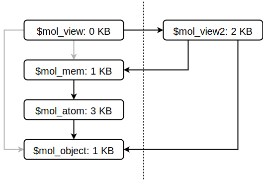

# $mol - лучшее средство от геморроя

> Вы можете открыть эти слайды в [интерфейсе проведения презентаций](https://nin-jin.github.io/slides/mol/) или [читать их как статью](https://github.com/nin-jin/slides/blob/master/mol/).

> Всем привет, меня зовут Дмитрий Карловский и я.. хочу причинить вам боль. Много боли. Я напомню вам обо всех страданиях, что вы испытваете находясь в плену своего любимого фреймворка. Я опущу вас на самое дно самой глубокой безысходности. А потом, когда вы совсем отчаетесь и потеряете веру в комьюнити, я подам вам руку помощи и покажу светлое будущее.


# Высокоуровневые фреймворки

> Вот выбрали вы фреймворк. Как вы представляете себе работу с ним? Ну, это должен быть богатый набор готовых решений, из которых можно легко и быстро собрать приложение любой сложности.


> Примеры таких фреймворков: ExtJS, SAPUI5, VCL.JS, $mol - они предоставляют вам кучу готовых виджетов, от банальных кнопочек, до сложных гридов с сортировками, фильтрацией и прочими прекрасными дамами.

> Могие ли слышали про них? А многие ли используют их в повседневной работе? Не многие. Странно, не находите?

# Низкоуровневые фреймворки

> К сожалению, более популярны сейчас низкоуровневые фреймворки, дающие только самые базовые абстракции над платформой, а всё остальное приходится реализовывать руками или искать на просторах интернета и прикручивать синей изолентой, получая в результате уникальный высокоуровневый фреймворк для каждого проекта.


> Примеры таких фреймворков у всех на слуху. Это: Angular, VueJS, Ember и многие другие.

# Библиотеки с замашками фреймворка

> В последнее время набрал популярность тренд строить экосистему вокруг отдельных узкоспециализированных библиотек. Тут всё ещё хуже - в каждом проекте приходится сначала собрать из кучи библиотек низкоуровневый фреймворк по своему вкусу, а поверх него уже велосипедить компоненты, которые зачастую не отличаются переиспользуемостью за пределами разрабатываемого проекта.


> Наиболее известные примеры: React, Backbone, jQuery

# Сборная солянка библиотек

> Ну и самый экстремистский вариант - просто взять разных библиотек, как-нибудь их друг с другом состыковать и постоянно терпеть дискомфорт от того, что абстрации одной библиотеки плохо стыкуются с абстракцией другой и вокруг всего этого как снежный ком растут костыли, велосипеды, копипаста и прочие нехорошие личности.


> Примеры приводить не буду, дабы не пропагандировать экстремизм.

# $mol - высокоуровневый, но гибкий

> Почему же высокоуровневые фреймворки так не популярны и из проекта в проект мы пилим одни и те же велосипеды? Дело в том, что большинство из них имеют крайне низкое качество. Они огромные, тормозные, сложные в изучении, а главное - очень дубовые, из-за чего кастомизация их компонент под проект сравнима по трудоёмкости с написанием этих компонент с нуля.


> Но из общего ряда монстров выбивается фреймворк $mol. Он легковесней и шустрее многих низкоуровневых фреймворков, но при этом он идет с богатым набором батареек в комплекте, позволяющих собрать сложное приложение буквално несколькими строками кода. И это богатство совсем не отягощает конечное приложение, ведь включаются в него лишь тот код, что реально необходим и ничего лишнего.

# Сравним размеры

> Итак, возьмём наиболее ярких представителей из трёх разных уровней: библиотеку React, низкоуровневый фреймворк Angular и высокоуровневый $mol. Создадим каждым из них по тривиальному статичному приложению и посмотрим какие накладные расходны дают разные инструменты.

|             | **Level** | **Proj create** (s) | **Proj size** (KB) | **Deps** | **App size** (KB) | **App start** (ms)
|-------------|-----------|---------------------|--------------------|----------|-------------------|-------------------
| **React**   | Lib       |                  70 |            120 000 |      892 |            **45** |                230
| **Angular** | Low       |                  50 |            160 000 |      752 |            **80** |                350
| **$mol**    | High      |                   0 |                200 |        0 |            **15** |                150

> Вручную создавать проекты на Реакте и Ангуляре - задача не тривиальная, поэтому используем стандартные кодогенераторы (create-react-app и @angular/cli). Они около минуты генерируют кучу файлов, после чего вы уже можете удалить лишние и добавить нужные.

> В $mol же новое приложение создаётся просто созданием директории и расположением в ней нужных вам файлов, без установки восьми сотен зависимостей. Как видите высокоуровневый фреймворк $mol даёт в 3 раза меньшую прибавку к размеру страницы чем одна только библиотека React. Теперь вы понимаете, почему к $mol мы даже не прикручивали никакой минификации? Просто нет никакого смысла разменивать удобство отладки и скорость сборки на незначительное уменьшение и без того малых объёмов кода.

# Использование сторонних компонент

> Что обычно нужно для того, чтобы воспользоваться сторонним компонентом?

1. Найти в интернете и выбрать из альтернатив.
2. Установить совместимую версию.
3. Импортировать и зарегистрировать.
4. Воспользоваться.

> Не очень удобно, правда?

# Использование сторонних $mol компонент

> Основной принцип $mol - атоматизация, так что воспользоваться сторонним компонентом крайне просто: 

1. Выбрать компонент из [каталога](http://mol.js.org/).
2. Воспользоваться.

> Сборщик сам позаботится о скачивании его исходников и включении их в правильные места результирующих бандлов.

# Удаление сторонних компонент

> А что обычно приходится делать, когда компонент больше не нужен?

1. Перестать использовать.
2. Не забыть удалить импорт и регистрацию.
3. Не забыть удалить зависимость от него.

> Столько всего нужно не зыбыть, чтобы в вашем приложении не было лишнего кода. И делать это надо вручную.

# Удаление сторонних $mol компонент

> А что делать, когда вам не нужен $mol компонент?

1. Перестать использовать.

> Другой основной принцип $mol - не платить за то, что не используешь. А это значит, что достаточно перестать использовать компонент, чтобы он перестал включаться в бандл. Всё крайне просто и надёжно, ведь человеческий фактор исключён полностью.

# Версионирование

> Допустим, вы нашли два замечательных компонента: красивый datepicker и продвинутый datagrid. Но вот беда, один во всю использует возможности новой версии фреймворка, а другой с ней ещё не совместим. Что же делать, если отказываться от одного из них не хочется? А хочется уже и самим использовать новые возможности, но переписывание всех старых компонент может занять не один месяц.


# Несколько версий разом

> Вы можете попытаться включить в бандл обе версии фреймворка, но это мало того, что существенно раздует объём приложения, так ещё и скорее всего не заведётся. Хотя бы даже потому, что пакетный менеджер не позволит вам установить одновременно две версии одного фреймворка.


# Версионирование в $mol

> В $mol мы отказались от версионирования модулей вообще. Вместо этого мы действуем по принципу "открытости/закрытости":

1. Любой модуль открыт для расширения интерфейса.
2. Любой модуль закрыт для изменения интерфейса.

> Это значит, что вы можете безопасно обновлять все модули до последних ревизий, не беспокоясь о том, что у них изменился API.

# Обновление API в $mol

> Но что же делать, когда нужно вести более удобное API не совместимое с уже существующим? А всё просто - если API не совместимо, то это уже другой модуль, с другим именем. Имя может быть и похожее. Например, с увеличенным числом в конце. При этом, раз это будут два разных модуля, то и сосуществовать в проекте они смогут одновременно. При этом у них может быть много общего кода, вплоть до: один - это не более чем легковесный фасад для другого.



> На диаграмме вы видите, что гипотетическая новая версия движка рендеринга $mol компонент, при сосуществовании с предыдущей, лишь незначительно увеличит объём бандла. Могли ли вы себе такое представить в каком-либо другом фреймворке?

> Не удивляйтесь тому, что модули в $mol такие маленькие, ведь при автоматизации работы с зависимостями, создавать и использовать микроскопические модули - одно удовольствие.

# Потоки данных

> Вручную рулить потоками данных - настоящий ад. Вы вроде бы продумали все варианты, учли все события, но стоит отдать результат тестировщикам, как на вас потоком начинает валиться куча баг-репортов, являющихся следствием противоречивой логики. Для совладания с оной у вас есть 2 варианта написания кода:

1. Использовать стримы (streams)
2. Использовать ячейки (cells)

# Стримы

> В Angular, например, ставку сделали на концепцию стримов, где вы статически настраиваете потоки событий и реакции на них. К сожалению, любое нетривиальное приложение имеет много динамики, а значит составить для него эффективную конфигурацию потоков - настоящая головоломка. Посмотрите только как на стримах выглядит правильное условное ветвление по двум переменным:

```typescript
const Result = Rx.Observable.combineLatest( Pos , Start )
.select( ([ pos , start ])=> {
	return pos < start ? Left : Rx.Observable.of( null )
} )
.switch()
.distinctUntilChanged()
.debounce( 0 )
```

# Ячейки

> Ячейки же представляют из себя так называемые реактивные переменные, которые сами отслеживают зависимости между собой, динамически выстраивая потоки данных наиболее оптимальным образом. При этом код получается простым и компактным:

```typescript
@ $mol_mem
result() {
	return this.pos() < this.start() ? this.left() : null
}
```

> Это - наглядный пример того, как грамотная архитектура позволяет писать эффективный код не теряя в наглядности и не раздувая его размеры.

> Уверен вы слышали про VueJS или MobX - они как раз основаны на концепции ячеек.

# Очепятки

> Наверняка каждый, съевший JavaScript собаку, может припомнить в своей практике не одну увлекательную историю, когда из-за одной маленькой опечатки он пол дня бился с каким-нибудь невозможным багом. Проблема в том, что человек - существо по природе невнимательное. Он легко допускает самые глупые ошибки, а потом может не видеть их, смотря на них в упор.


> Решением этой пробемы является статическая типизация, позволяющая компьютеру автоматически и за конечное время проверить корректность кода, разгружая мозг программиста от кучи мелочей и позволяя ему концентрироваться на действительно важных вещах.

> Но много ли вы знаете фреймвоков, написанных на TypeSript? Я знаю всего 4: Angular, VCL.JS, CycleJS и... $mol. Все остальные попросту непригодны для разработки более-менее крупного проекта.

# Стилизация сторонних компонент

> Ок, прикрутили мы datepicker, и он даже работает. Да вот беда, выглядит он как белая ворона в чёрном квартале.

> Если разработчик компонента во имя великой инкапсуляции изолировал стили с помощью css-in-js, css-modules или даже web-components, то можно вас только поздравить с необходимостью стилизовать сторонний компонент через вязанку костылей. Например, такого рода селекторы у вас могут получиться при необходимости стилизовать дни в выпадающем календарике:

```css
/* No isolation */
.my_date .acme_calendar_day { ... }

/* Angular default isolation */
:host ::ng-deep .calendar ::ng-deep .day { ... }

/* CSSModules isolation */
.date [class*="calendar"] [class*="day"] { ... }
```

# Инкапсуляция и изоляция

> Важно понимать разницу между инкасуляцией и изоляцией. 

- Инкапсуляция - возможность работать не зная внутренностей
- Изоляция - невозможность работать со внутренностями

> Инкапсуляция позволяет работать со сложной штукой через простой интерфейс, но не мешает погрузиться во внутренности, когда это действительно необходимо. Изоляция же - гораздо более сильное ограничение, которое связывает вас по рукам и ногам, и заставляет вас форкать сторонний компонент, чтобы вписать его в ваше приложение.

# Стилизяция $mol компонент

> $mol пронизан инкапсуляцией с ног до головы. Но изоляции в нём нет. Вообще. Никакой. Даже в скриптах. Зато в $mol есть глобальные уникальные человекопонятные имена и единые правила стилизации, что своих, что сторонних компонент.

```css
/* Base styles from $mol_calendar component */
/* that contains $mol_view's as "Day" name */
[mol_calendar_day] { ... }

/* Overrided styles from $mol_date component */
/* that contains $mol_calendar as "Calendar" name */
[mol_date_calendar_day] { ... }

/* Custom styles for $my_date component */
/* that extends $mol_date */
[my_date_calendar_day] { ... }
```

> В приведённом примере, имя "my_date_calendar_day" формируется автоматически по следующему принципу.. Сперва берётся глобальное имя компонента "my_date", потом к нему приклеивается локальное имя календарика в контексте владельца "calendar" и так далее до нужного компонента, как бы глубоко в иерархии он ни находился.

> Но самое главное - программисту не надо вручную прописывать эту вязанку классов каждому дом-элементу - они генерируются автоматически исходя из сформированного дерева компонент. Вы только представьте: можно разрабатывать компонент совершенно не думая о его стилизации, но при этом иметь полный контроль за визуализацией любого дом-элемента. Без костылей, гор копипасты, увеличения специфичности селекторов и прочих гадких штук.

