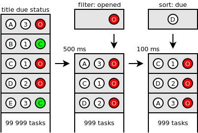
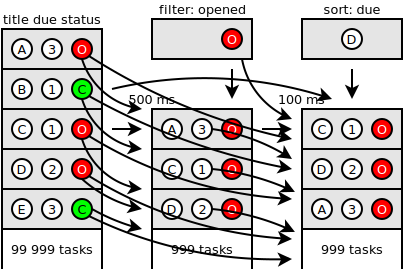
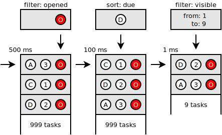
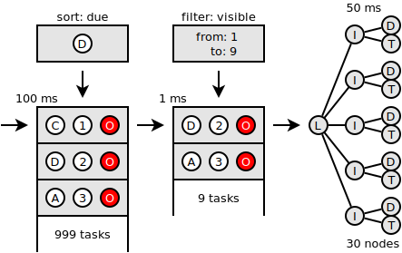
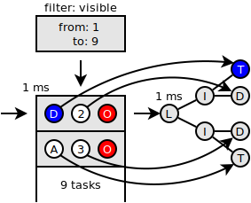
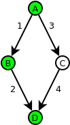

# Объектно Ориентированное Реактивное Программирование

- Докладчик: **[Дмитрий Карловский](https://github.com/nin-jin/)**
- Дата: **2017-05-02**
- Конференция: **[HolyJS](https://holyjs.ru/)**
- Слайды: **[//nin-jin.github.io/slides/oorp/](https://nin-jin.github.io/slides/oorp/)**

> Привет всем землянам, меня зовут Дмитрий Карловский и я.. не буду строить из себя успешного разработчика и, прикрываясь крупной фирмой за плечами, продавать вам модную технологию, которая решит одни пробелемы, создав при этом ворох других. Доклад мой будет о незаслуженно непопулярной, но весьма элегантной парадигме и её удивительных возможностях.

> **Итак, что такое Объектное Программирование?** Основной его чертой является объединение данных и функций для работы с ними в рамках одной абстракции с относительно простым интерфейсом - объекте.

> **А что такое Функциональное Программирование?** Тут вся программа описывается в виде кучи чистых функций, которые не зависят от изменяемого состояния и сами не изменяют никаких состояний.

> **Наконец, что такое Реактивное Программирование?** Здесь вы описываете правила получения одних состояний из других таким образом, что изменение одного состояния приводит к каскадному изменению зависимых.

> У многих Реактивное Программирование прочно ассоциируется с Функциональным, однако, оно куда ближе к Объектно Ориентированному, так как основные действующие лица в Реактивном Программировании - изменяемые состояния. И, хотя зависимости между состояниями зачастую описываются в виде функций, они вовсе не обязаны быть чистыми, но должны быть идемпотентными, но об этом позже. А пока давайте рассмотрим простой случай, с которым я столкнулся на одном из проектов...

# Вся тяжесть зависимости

## Список задач

> Представьте, что вам надо реализовать менеджер задач. Причём не абы как, а стильно, модно, молодёжно, быстро, гибко и надёжно..
> Типичное число задач в аккаунте - порядка десятка тысяч, что позволяет нам выгрузить все данные на клиентское устройство и работать с ними без сетевых задержек.
> Но в некоторых долгоживующих аккаунтах число задач может доходить и до сотни тысяч, а в каждой задаче может быть до пары десятков полей с данными. По объёму это относительно много, но пользователь не против с утра немного подождать загрузки данных лишь бы потом всё летало.


> Тут у нас схематично изображён список из большого числа задач, для каждой из которых отмечено три свойства: название, оценка времени и статус "открыта/закрыта".

## Добавляем фильтрацию

> Но обычно пользователю не нужны вообще все задачи, а только лишь их некоторая часть, соответствующая заданным критериям.


> В данном примере, мы оставили в списке лишь задачи со статусом "открытая", но реальные критерии могут быть самыми разнообразными и затрагивать разные поля задач, в том числе и разные поля у разных задач. Поэтому выполнение сложного фильтра на большом объёме данных может быть ощутимо продолжительной операцией, а значит чем реже нам потребуется её запускать, тем отзывчивее будет наше приложение.

> В данном примере, очевидно, повторная фильтрация нам потребуется в случае изменения критериев фильтрации, или изменении статуса одной из задач. Но если при изменении названия задачи мы будет перезапускать фильтрацию - это будут тормоза на ровном месте. Поэтому важно знать от каких конкретно свойств каких конкретно задач зависит результат фильтрации, чтобы перезапускать его только при изменении тех состояний, что реально влияют на результат.

## Добавляем сортировки

> Пользователю обычно нужно просматривать задачи не в произвольном порядке, а в каком-то конкретном. Поэтому он должен иметь возможность указать критерии сортировки, которые опять же могут затрагивать различные свойства задач и быть достаточно прожорливыми на больших списках.



> Тут мы, для примера, добавили сортировку по сроку выполнения задачи. Очевидно, повторную сортировку нужно будет произвести лишь при изменении критерия сортировки... И срока исполнения, но не всех задач, а только если срок меняется у тех задач, что соответствуют критерию фильтрации... И, соответственно, при изменении самого этого критерия. И...

## Учёт всех зависимостей

> Если вы попытаетесь в коде описать все зависимости между всеми состояниями, то это приведёт к комбинаторному взрыву и вам оторвёт руки. 



> Поэтому без Реактивного Программирования мы не сможете сделать сколь-нибудь сложное приложение быстрым, надёжным и компактным одновременно.

> При этом важно, чтобы вычисления происходили в правильном порядке. Если мы пересортируем список, потом перефильтруем, то затем нам снова придётся сортировать, но уже новый результат фильтрации. Получается первую фильтрацию мы делали зря. А ведь это время, задержки, злой пользователь, крутящий мышью вокруг застывшей анимации.

> Вы можете сказать, что я сгущаю краски, а конкретно в вашем проекте никогда не будет столько данных, и тяжёлой их обработки, и открывать ваше приложение будут лишь на мощных рабочих станциях, а не на хилом китайском тапке в режиме энергосбережения.

> Но на это у меня есть простое соображение. Для обеспечения плавности работы вашему приложению необходимо работать со скоростью в 60 fps, что даёт всего 16 миллисекунд на все операции начиная с подготовки данных, заканчивая пересылкой отрисованных областей в видеопамять. И превысить эти 16 миллисекунд очень просто даже в довольно простом приложении на довольно мощном компьютере.

## Отображение лишь видимого

> Если вы будете отображать все данные, что подготовили, то алгоритмическая сложность рендеринга будет пропорциональная объёму данных. 10 задач рендерятся мгновенно. 1000 задач рендерится уже пару секунд. Если у пользователя такой экран, что одновременно в него влезает не более 10 задач, то визуально для него не будет никакой разницы - будете ли вы рендерить всю 1000 или только 10 из них. Поэтому, каким бы быстрым ни был у вас ~~React~~ шаблонизатор, он всегда будет проигрывать по отзывчивости архитектуре с ленивым рендерингом, которая в гораздо меньшей мере зависит от объёмов данных.



> Если высота каждой строки нам известна заранее, то, зная высоту окна, легко понять какие задачи точно не видны, а какие может хоть краешком но влезают в видимую область. Вырезать из огромного списка элементы с первого по девятый - плёвая операция. Но только, если этот список у нас хранится где-то в закешированном виде. Если же мы при скроллинге будем на каждый фрейм пересортировывать список, а то ещё и перефильтровывать его, то у нас всё приложение встанет колом.

> К чему это я? А к тому, что красивая абстракция "DOM как чистая функция от состояния" течёт по швам. Для повышения отзывчивости необходимо вводить промежуточные состояния, которые будут кешировать результаты вычислений и отслеживать зависимости, чтобы при их изменении сбрасывался и кеш.

## Примерение изменений к DOM

> Ок, данные мы подготовили, осталось показать их пользователю. 



> Решение в лоб - удалить старое дерево и вставить новое - мало того, что медленное, так ещё и может вызывать глюки типа "потери фокуса", "сброс позициии скроллинга в 0" и тому подобные. Короче, реальность упорно не хочет быть чистой функцией - для повышения отзывчивости нужно изменять существующее состояние, а не просто создавать новое.

## Виртуальный DOM

> Как подружить ужа с ежом? Правильно, давайте генерировать новый DOM всего приложения, а потом ~~React~~ специальная библиотека будет сравнивать его новую и старую версию и применять различия к тому DOM-у что видит пользователь.


> Звучит как костыль, не правда ли? Посмотрите на схему - сколько работы приходится выполнять только лишь для того, чтобы, когда пользователь меняет имя задачи, оно тут же менялось и в списке задач.

## Прямые зависимости

> Как могла бы выглядеть работа наиболее эффективного решения?



> Всё просто - между исходными данными и их отображением устанавливаются прямые связи. При изменении одного состояния, изменяется и зависимое от него. Причём действует это не только между так называемыми "моделью" и "отображением", а между любыми зависимыми состояниями, начиная с базы данных на сервере, через кучу промежуточных состояний и заканчивая дом-узлом в браузере. Именно в этом и заключается суть Реактивного Программирования, а не в шаблонизаторе с созвучным названием, который продают нам на каждой конференции.

# Отслеживание зависимостей

## Тянуть или толкать?

> Есть два принципиально разных способа реализации реактивности.

> Первый - это всякие беконы, RX-ы и прочий стрим-панк, так же известный как Функциональное Реактивное Программирование. Суть его в том, что вы явным образом получаете так называемые стримы, от которых зависит ваше состояние и добавляете к ним функцию вычисления нового значения. Каждый стрим как бы проталкивает своё значение во все зависимые стримы, а что с этим значением делать или не делать они уже решают сами.

```typescript
// **FRP**
const Greeting = Is_name_showing
.select( is_name_showing => {
	if( is_name_showing ) {
		return User_name
		.map( user_name => {
			return `Hello, ${ user_name }!`
		} )
	} else {
		return Rx.Observable.of( 'Hello!' )
	}
} )
.switch()
.distinctUntilChanged()
.debounce( 0 )
```

> Посмотрите на этот FRP-ребус и попробуйте сходу сказать, что и зачем он делает. А делает он правильное ветвление логики: в зависимости от флага ```Is_name_showing``` стрим ```Greeting``` либо зависит от стрима ```User_name``` либо не зависит. В последнем случае при изменении имени пользователя не будет происходить повторного вычисления приветствия.

> Данный подход приводит к сложному, трудноподдерживаемому коду. Его трудно читать. Его сложно писать. Его лень писать правильно. В нём легко допустить ошибку, если вы, конечно, не финалист специальной олимпиады по информатике.

> Поэтому куда проще и эффективней использовать другой подход, где вычисления начинаются не от источника данных, а от потребителя. Если он обратился к какому-то изменяемому состояниею, значит он от него зависит и должен быть пересчитан, когда то состояние изменится. Код в этом случае получается крайне простым, гибким и, не смотря на затраты на трекинг зависимостей во время исполнения, эффективным.

```typescript
// **OORP**
greeting() {
	if( this.is_name_showing() ) {
		return `Hello, ${ this.user_name() }!`
	} else {
		return 'Hello!'
	}
}
```

> Не правда ли OORP код куда проще, а делает ровно то же самое. Если при вычислении значения не произошло обращения к свойству ```user_name```, то при изменении этого свойства никаких пересчётов происходить не будет. А если в какой-то момент мы вдруг начнём обращаться к имени пользователя, то при его изменении теперь будет происходить пересчёт. Пока мы не перестанем к нему обращаться в последующих пересчётах, разумеется.

## Сразу или потом?

> Ок, с построением графа зависимостей разобрались. Осталось решить когда обновлять зависимые состояния.

> Решение в лоб - как только состояние изменилось - последовательно идём по зависимым состояниям и обновляем их и по мере их обновления обновляем и зависимые от них и так далее. Именно так работает по умолчанию OORP библиотека [KnockOut](http://knockoutjs.com) и все FRP библиотеки.

> К сожалению, не всё так просто и действя так мы в некоторых случаях можем получить дичайшие тормоза.



> На иллюстрации вы видите простейшую структуру зависимостей, которая приводит к лишним вычислениям. Изменение состояния ```A``` привело к изменению состояния ```B```, что вызвало пересчёт состояния ```D```, но в этом пересчёте использовалось старое состояние ```C```, поэтому когда очередь доходит, наконец, и до него, то мы вдруг выясняем, что ```D``` нужно снова обновлять.

> В сложном приложении таких ромбов может быть довольно много, что многократно уменьшает отзывчивость оного.

## А если в порядке увеличения глубины?

> Решение, которое было реализовано в моей библиотеке [$jin.atom](https://habrahabr.ru/post/235121/), заключалось в том, чтобы для каждого состояния поддерживать актуальным значение его максимальной глубины. Таким образом все состояния раскладывались в отдельные слови, а обновление происходило от нижнего слоя к верхнему, что гарантировало, что к моменту вычисления определённого состояния все зависимости точно приняли актуальное значение.


> Работало это отлично и показывало хорошую производительность, но иногда приводило к странным исключениям и тупнякам на ровном месте. Например, когда ```D``` в зависимости от состояния ```B``` вдруг перестаёт обращаться к ```C```. Получается, мы зря вызвали пересчёт ```C```. Но узнали мы об этом уже слишком поздно. Живой пример - когда вы переходите между экранами приложения. Вместо того, чтобы просто удалить старый экран, он может начать обновляться соответственно изменению ссылки, а потом уже будет уничтожен. И вам повезёт, если это не вызовет никаких исключительных ситуаций.

## А если в порядке создания?

> Автор [VueJS](http://vuejs.org) не стал заморачиваться и просто даёт каждому состоянию порядковый номер. Обновления состояний соответственно идут в порядке увеличения порядкового номера. Сначала это работает хорошо, но чем дольше работает ваше приложение тем в более случайном порядке происходит обновление состояний, порождая всё те же проблемы лишних пересчётов.

> *Также стоит разобрать: MobX, CellX, ReSelect* 

# Правильный алгоритм

> Как же гарантировать правильный порядок обновления состояний, ведь пока мы не актуализировали все зависимости обновлять зависимое состояние нет смысла, но пока не вычислишь зависимое состояние и не узнаешь актуальный набор зависимостей?

## Построение графа зависимостей

> *Все вычисления происходят лениво. Между состояниями динамически строится направленный ациклический граф зависимостей. Каждый узел знает кто от него зависит и от кого он зависит.*

## Каскадная инвалидация

> *Все зависимые узлы помечаются устаревшими, а косвенно зависимые - возможно устаревшими. Узел, от которого никто не зависит откладывается для последующего обновления.*

## Отложенный пересчёт

> *Перед обновлением каждый узел убеждается в актуальности зависимостей в том же порядке, в котором они вычислялись ранее. И если хоть одна из них изменилась - обновляется и сам.* 

## Покажите мне код!

> *Пример ООРП кода с использованием библиотеки $mol_mem c объяснением его работы.*

## А если исключительная ситуация?

> *Обычно исключения безвозвратно ломают приложение. Однако, исключение - такой же результат вычисления, как и собственно возвращаемое значение. Устранение причины исключения должно восстанавливать работу приложения.* 

# Асинхронщина

## Синхронный блокирующий

> Взгляните на пример кода, который вычисляет сообщение о числе тёзок текущего пользователя. 

```
namesakes_message() {
	const user = this.user()
	const count = this.name_count( user.name )
	
	return this.texts().namesakes_message
	.replace( /\{count\}/g , count )
}
```

> Метод ```user``` делает запрос к серверу за информацией о пользователе, откуда берётся его имя и оно передаётся в метод ```names_count```, который запрашивает у другого сервера число пользователей с данным именем. Потом мы дёргаем метод ```texts```, чтобы получить тексты для текущей локали, берём оттуда нужный текст и подставляем в него полученное ранее число.

> Код простой и понятный, не правда ли? Но тут есть одна беда: пока выполняется каждый из этих трёх запросов всё приложение встаёт колом, так как виртуальная машина javascript однопоточная, а эти запросы блокируют поток до своего завершения.

# Асинхронный неблокирующий Promise

> Чтобы решить проблему блокировки потока на время выполнения запроса в яваскрипте принято присать код на колбэках, в котором сам чёрт ногу сломит.

```
namesakes_message() {
	
	return Promise.all([
		this.user() ,
		this.texts() ,
	])
	.then( ([ texts , user ])=> {
		
		return this.name_count( user.name )
		.then( count => {
			
			return texts.namesakes_message
			.replace( /\{count\}/g , count )
			
		} )
		
	} )
	
}
```

> Обратите внимание, что тут мы грузим информацию о пользователе и тексты паралельно, так как они не зависят друг от друга. Это ускоряет общую загрузку всех ресурсов. Но поддерживать такой код - смерти подобно.

## Синхронный неблокирующий async/await

> Недавно в яваскрипте появились средства синхронизации, но действуют они лишь в пределах одной функции, а не всего стека вызовов.

```
async namesakes_message() {
	
	const [ texts , user ] = await Promise.all([
		this.texts() ,
		this.user() ,
	])
	
	const count = await this.name_count( user.name )
	
	return texts.namesakes_message
	.replace( /\{count\}/g , count )
}
```

> Если мы пометили функцию как "асинхронную", то мы можем приостанавливать её до появления определённого события. Код снова становится простым и понятным, разве что для распараллеливания запросов нам всё ещё нужно кастовать специальные заклинания.

## Синхронный неблокирующий на атомах

> А что если я скажу вам, что следующий код не смотря всю на свою синхронность может быть не только неблокирующим, но и грузить информацию о пользователе и тексты параллельно? 

```
@ $mol_mem()
namesakes_message() {
	const texts = this.texts()
	const user = this.user()
	const count = this.namesakes_count( user.name )
	
	return texts.namesakes_message
	.replace( /\{count\}/g , count )
}
```

> Не без ограничений, но ООРП позволяет вам писать предельно простой и понятный код, при этом по максимуму используя возможности неблокирующих запросов.

# Обратный поток данных

## Движение данных


## Двунаправленные зависимости

> *Диаграмма двусторонних биндингов в Angular. Отсутствие единственного источника истины порождает проблемы.*

## "Однонаправленный" поток данных

> *Диаграмма FLUX. Проблема - обратный поток идёт в обход компонент, внутренняя кухня компонент просачивается в корень приложения.*

## Изменяемые свойства как абстракция

> *Компонент выступает в роли посредника между вложенными компонентами и объемлющим, абстрагруя внешний слой от внутреннего и наоборот. Компоненты взаимодействуют лишь через свойства из которых можно что-то затянуть и в которые можно что-то затолкать. Что реально делается при этом полностью зависит от реализации геттеров и сеттеров этих свойств.*

# Композиция компонент

## Абстракции

> *Компонент - обычный объект. Свойство - обычный полиморфный метод, который либо возвращает значение, либо устанавливает новое и возвращает актуальное.*

## Переопределение

> *Переопределение свойств при создании как способ настройки поведения.* 

## Связывание

> *Элегантное связывание свойств через переопределение. Двустороннее замещает свойство вложенного компонента свойством владельца (измерение одного приводит к естесственному изменению другого и наоборот). Левостороннее - только значением свойства владельца (вложенный компонент изменить значение не может). Правостороннее - свойство владельца вычисляется из свойства вложенного компонента (владелец изменить значение не может).*

## Коммуникация

> *Связывание компонент друг с другом чере общего родителя.*

## Реактивный рендеринг

> *Состояние dom-узла зависит от свойств компонента и от dom-узлов вложенных компонентов. Эта простая схема позволяет точечно обновлять DOM не производя лишних вычислений.*

## Исключительные ситуации

> *Ошибки, ожидание загрузки и тп автоматически перехватываются и визуализируются. Это позволяет частям приложения падать и восстанавливать свою работу, не ломая других частей.* 

# Ложка дёгтя

## Императивное изменение зависимости

> *Когда вам нужно изменить значение от которого вы зависите. Например - увеличить на 1. Красивого решения пока нет. Есть такое: для изменения запускать отдельную независимую реактивную задачу (самоуничтожающийся по завершении вычисления атом).*

# Резюме

> Не гонитесь за хайпом. Мода переменчива и часто тащит нас в болото. Разумеется большой компанией выбираться из жопы интересней. Но если вы хотите вырваться вперёд, пока остальные буксуют, нужно учиться трезво и рационально оценивать технологии, выбирая те, что уменьшают сложность разработки, а не увеличивают её. Если ваш единственный аргумент - число разработчиков "знающих" технологию, то готовьтесь к тому, что через пару лет никто из них уже не захочет с ней связываться, а через 5 - вы не найдёте никого, кто смог бы разобраться в коде проекта.

# Вопросы?
