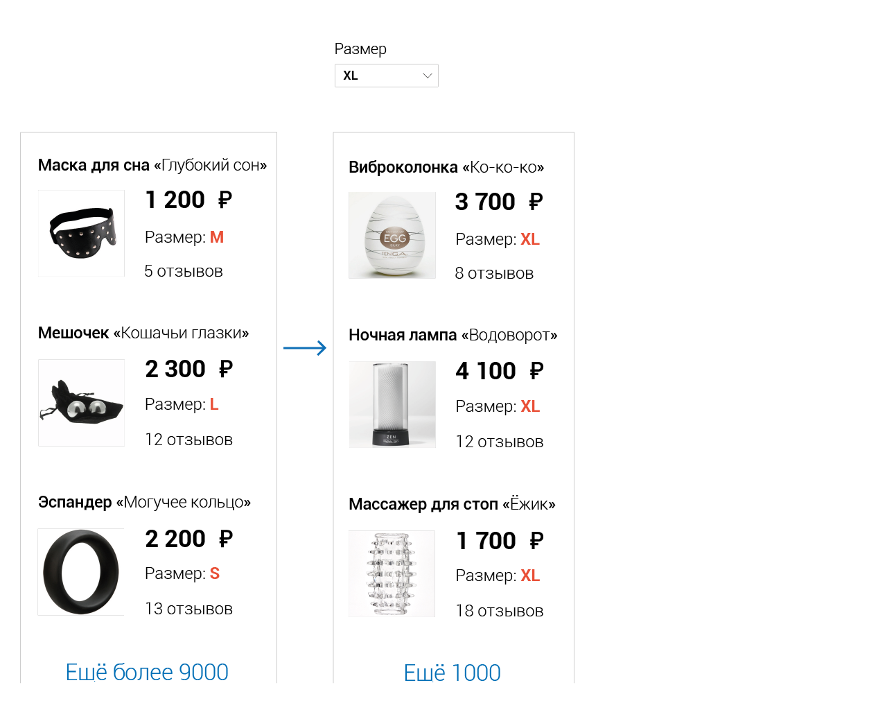
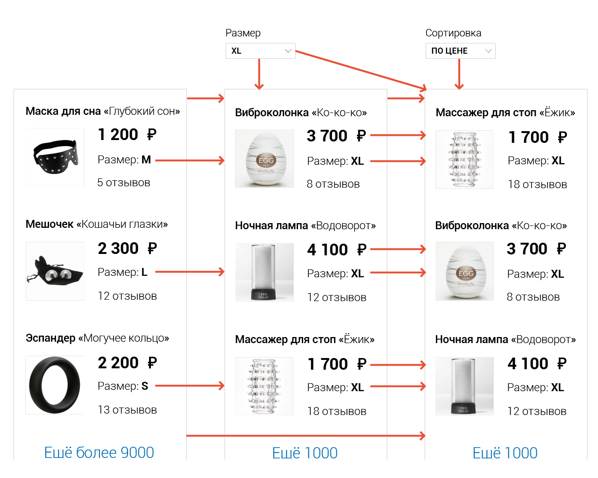
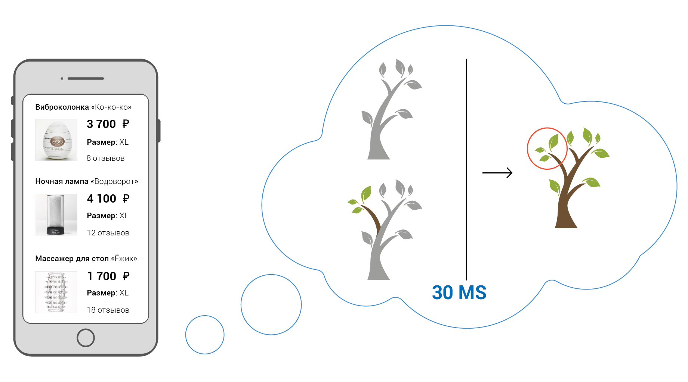
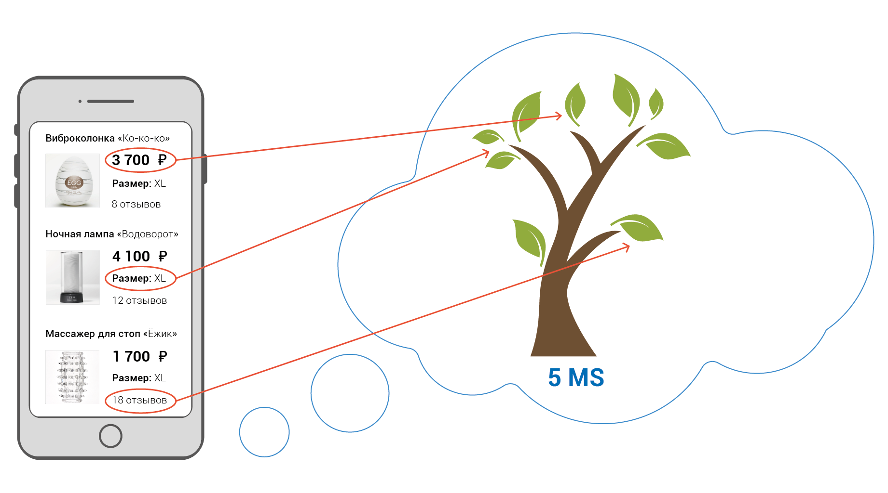
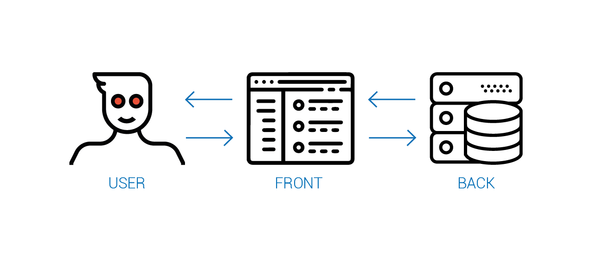

# Объектное Реактивное Программирование

**[Дмитрий Карловский](https://github.com/nin-jin/)** из **[SAPRUN](http://www.saprun.com)** представляет... ммм...

| Надоело.. | Чем поможет ОРП? |
|-----------|------------------|
| .. писать много, а делать мало? | Пиши мало, делай много!
| .. часами дебажить простую логику? | Реактивные правила обеспечат консистентность!
| .. асинхронщина? | Синхронный код тоже может быть неблокирующим!
| .. что всё по умолчанию тупит? | ОРП оптимизирует потоки данных автоматом!
| .. функциональные головоломки? | Объекты со свойствами - проще некуда!
| .. что приложение падает целиком? | Позволь упасть его части - само поднимется!
| .. жонглировать индикаторами ожидания? | Индикаторы ожидания пусть сами появляются, где надо!
| .. двустороннее связывание? | Двустороннее связывание нужно правильно готовить!
| .. пилить переиспользуемые компоненты? | Пусть компоненты будут переиспользуемыми по умолчанию!
| .. вечно догонять? | Вырывайся вперёд и лидируй!

# Рекламная пауза


> Добрый день, я - **Дмитрий Карловский**. Являюсь **руководителем группы веб-разработки** компании САПРАН. Компания наша является **крупнейшим интегратором САП-а** в России, но в последнее время мы активно смотрим в сторону разработки **собственных программных продуктов**. Конкретно наш департамент развивает платформу быстрой и безопасной доставки данных на мобильное устройство **"HyperHive"** и кроссплатформенный open source фреймворк быстрого построения отзывчивых интерфейсов **"$mol"**, в котором мы по максимуму применяем возможности **Объектного Реактивного Программирования**, о которых я и расскажу далее...

# Что будем делать?

> Давайте представим, что мы решили **открыть интернет-магазин** по продаже игрушек. Причём сделать мы хотим всё не абы как, а **стильно, модно, молодёжно, быстро, гибко и надёжно**..


# Каталог товаров

> **Игрушек** у нас **много**, а начать продажи надо было ещё вчера. Мы можем загрузить все данные на клиентское устройство и **быстро, без сетевых задержек**, позволить пользователю просматривать каталог в реальном времени отслеживая изменения в нём.


# Фильтрация

> Листать этот огромный каталог, конечно, увлекательно, но пользователю хотелось бы ограничить его лишь теми игрушками, что особенно интересуют его в данный момент. Поэтому мы добавляем фильтрацию. Отфильтровать игрушки можно по самым разным параметрам: по размеру, по цене, по рейтингу, по тексту в описании, да много по чему.



> На больших объёмах данных сложный фильтр может накладываться продолжительное время, поэтому для обеспечения отзывчивости нам бы не хотелось, чтобы фильтрация повторялась лишний раз.

> Например, если мы отфильтровали по тексту в описании, то нет смысла перефильтровывать каталог, когда меняется рейтинг какой-либо игрушки. Но если мы отфильтровали по рейтингу, то перефильтрацию в этом случае мы сделать уже обязаны.

> Поэтому важно знать от каких конкретно свойств каких конкретно товаров зависит результат фильтрации, чтобы перезапускать его только при изменении тех состояний, что реально влияют на результат.

# Сортировка

> Пользователь обычно хочет просматривать игрушки не в произвольном порядке, а в каком-то конкретном. Например: в порядке увеличения цены или уменьшения релевантности. Поэтому он должен иметь возможность указать критерий сортировки, который опять же может затрагивать различные свойства товаров и быть достаточно тяжёлыми на больших списках.


> Очевидно, повторную сортировку нужно будет произвести лишь при изменении критерия сортировки... или тех свойств товаров, от которых зависит сортировка. Но не любых товаров, а лишь тех, что соответствуют критерию фильтрации. И, соответственно, при изменении самого этого критерия. И...

# Учёт всех зависимостей

> Если вы попытаетесь описать в коде все зависимости между всеми состояниями, то это приведёт к **комбинаторному взрыву** и вам оторвёт руки. 



> Поэтому без Реактивного Программирования вы не сможете сделать сколь-нибудь сложное приложение **быстрым**, **надёжным** и **компактным** одновременно, так как оно позволяет описывать лишь прямые зависимости, а косвенные уже обновляются автоматически.

# Всё ли рендерить?

> Если вы будете отображать все данные, что подготовили, то алгоритмическая сложность рендеринга будет пропорциональная объёму этих данных. 10 товаров рендерятся мгновенно, 1000 - с задержкой, а 10000 - уже несколько секунд.


# Или не всё?

> Если у пользователя такой экран, что одновременно в него влезает не более 10 игрушек, то визуально для него не будет никакой разницы - будете ли вы рендерить всю 1000 или только 10 из них. Поэтому, каким бы быстрым ни был у вас ~~React~~ шаблонизатор, он всегда будет проигрывать по отзывчивости ленивой архитектуре, которая в гораздо меньшей мере зависит от объёмов данных.


# Отображение лишь видимого

> Если высота каждой строки нам известна заранее, то, зная высоту окна, легко понять какие товары точно не видны, а какие может хоть краешком, но влезают в видимую область. 


> Вырезать из огромного списка элементы с первого по десятый - плёвая операция. Но только, если этот список у нас хранится где-то в закешированном виде. Если же мы при скроллинге будем для каждого кадра пересортировывать список, а то ещё и перефильтровывать его, то ни о какой плавности скроллинга не может идти и речи.

# Примерение изменений к DOM

> Ок, данные мы подготовили, осталось показать их пользователю. Решение в лоб - удалить старое дерево и вставить новое. Именно так работают **все HTML-шаблонизаторы**.


> К сожалению это слишком медленно. Кроме того, это сбрасывает динамические состояния узлов. Такие как: "позиция скроллинга", "позиция каретки" и другие. Некоторые из них можно потом восстановить, но далеко не все.

> Реальность упорно не хочет быть чистой функцией - для повышения отзывчивости нужно по возможности изменять существующее состояние, а не просто создавать новое. А если не можешь победить - возглавь!

# Виртуальный DOM

> Как натянуть ужа на ежа? Правильно, давайте генерировать новое DOM дерево всего приложения, а потом ~~React~~ специальная библиотека будет сравнивать его новую и старую версию и применять различия к тому DOM дереву что реально видит пользователь.



> Звучит как костыль, не правда ли? Посмотрите на схему - сколько работы приходится выполнять только лишь для того, чтобы, изменить значение текстового узла, когда в одной из моделей поменялось строковое свойство.

# Прямые зависимости

> Как могла бы выглядеть работа наиболее эффективного решения?



> Всё просто - между исходными данными и их отображением устанавливаются прямые связи. При изменении одного состояния, изменяются лишь зависимые от него. Причём действует это не только между так называемыми "моделью" и "отображением", а между любыми зависимыми состояниями, начиная с записи в базе данных на сервере, через кучу промежуточных состояний и заканчивая дом-узлом в браузере. Именно в этом и заключается суть Реактивного Программирования, а не в шаблонизаторе с созвучным названием, который продают нам на каждой конференции.

# И так сойдёт!


> Вы можете сказать, что я сгущаю краски, а конкретно в вашем проекте никогда не будет столько данных, и тяжёлой их обработки, и запускать ваше приложение будут лишь на мощных рабочих станциях, а не на хилом китайском тапке в режиме энергосбережения.

# Треугольник серпинского на ReactJS

> Но на это у меня есть простое соображение. Для обеспечения плавности работы вашему приложению необходимо работать со скоростью в 60 кадров в секунду, что даёт всего 16 миллисекунд на все операции, начиная с подготовки данных, и заканчивая пересылкой отрисованных областей в видеопамять. И превысить эти 16 миллисекунд очень просто даже в тривиальном приложении на мощном компьютере.

[](http://nin-jin.github.io/react-fiber-vs-stack-demo/stack.html)

> Перед вами демо созданное ребятами из Facebook, демонстрирующее, как сильно виртуальный DOM сказывается на плавности анимации в достаточно сложном приложении. Они это сейчас пытаются решить размазыванием вычислений по кадрам, что даёт заветные 60 кадров в секунду, но привдит к визуальным артефактам. Фундаментальная же проблема остаётся неизменной - виртуальный DOM требует кучи вычислений на каждый чих.

# Треугольник серпинского с использованием ОРП

> ОРП, напротив, позволяет минимизировать объём вычислений, автоматически оптимизируя потоки данных от их источника до потребителя.

[](http://mol.js.org/perf/serp/)

> Как вы можете видеть, даже без размазывания вычислений по кадрам, нам удаётся показывать гораздо большую отзывчивость приложения. И всё это благодаря прямым реактивным связям между исходными данными и зависящих от них DOM-узлами.

# Парадигмы

> **Итак, что такое Объектное Программирование?** Основной его чертой является объединение данных и функций для работы с ними в рамках одной абстракции с относительно простым интерфейсом - объекте.

> **А что такое Функциональное Программирование?** Тут вся программа описывается в виде кучи чистых функций, которые не зависят от изменяемого состояния и сами не изменяют никаких состояний.

> **Наконец, что такое Реактивное Программирование?** Здесь вы описываете правила получения одних состояний из других таким образом, что изменение одного состояния приводит к каскадному изменению зависимых.


> У многих Реактивное Программирование прочно ассоциируется с Функциональным, однако, оно куда ближе к Объектному, так как основные действующие лица в Реактивном Программировании - изменяемые состояния. И, хотя зависимости между состояниями зачастую описываются в виде функций, они вовсе не обязаны быть чистыми. Они должны быть идемпотентными, но об этом позже.

# Проталкиваем (ФРП)

> Есть два принципиально разных способа реализации реактивности.

> Первый - это всякие беконы, RX-ы и прочий стрим-панк, так же известный как Функциональное Реактивное Программирование. Суть его в том, что вы явным образом получаете так называемые стримы, от которых зависит ваше состояние, добавляете к ним функцию вычисления нового значения. Полученное таким образом значение уже проталкивается во все зависимые стримы, а что с этим значением делать или не делать они уже решают сами.

```typescript
const FilterSource = new Rx.BehaviorSubject( toy => toy.count > 0 )
const Filter = FilterSource.distinctUntilChanged().debounce( 0 )

const ToysSource = new Rx.BehaviorSubject( [] )
const Toys = ToysSource.distinctUntilChanged().debounce( 0 )

const ToysFiltered = Filter
.select( filter => {
	if( !filter ) return Toys
	return Toys.map( toys => toys.filter( filter ) )
} )
.switch()
.distinctUntilChanged()
.debounce( 0 )
```

> Посмотрите на этот FRP-ребус и попробуйте сходу сказать, что и зачем он делает. А делает он простую штуку: создаёт стрим для товаров, стрим для критерия фильтрации и получает из них стрим отфильтрованного списка товаров.

> Тут уже применено несколько типовых оптимизаций. Тем не менее работает этот код очень не эффективно: список игрушек перефильтровывается даже если в товаре поменялись те данные, от которых результат фильтрации не зависит. Чтобы побороть эту проблему, придётся ещё на порядок усложнить код, но на это уже мало у кого хватит уситчивости.

> Данный подход приводит к сложному, трудноподдерживаемому коду. Его трудно читать. Его сложно писать. Его лень писать правильно. В нём легко допустить ошибку, если вы, конечно, не финалист специальной олимпиады по информатике.

# Затягиваем (ОРП)

> Куда проще и эффективней использовать другой подход, где вычисления начинаются не от источника данных, а от их потребителя.

```typescript
class $my_toys {

	@ $mol_mem()
	filter( next = ( toy )=> {
		return toy.count() > 0
	} ) { return next }

	@ $mol_mem()
	toys( next = [] ){ return next }

	@ $mol_mem()
	toys_filtered() {
		if( !this.filter() ) return this.toys()
		
		return this.toys().filter( this.filter() )
	}
}
```

> Не правда ли ORP код куда проще, и понятнее? Это тот же код, который мы бы написали безо всякого реактивного программирования, но мы добавили декоратор, который динамически отслеживает зависимости по факту обращения к ним, кеширует результат исполнения функции и сбрасывает кеш, когда зависимости изменяются.

> Правильная реализация логики этих декораторов позволяет производить вычисления наиболее оптимальным образом, не перекладывая головную боль по контролю потоков данных на прикладного программиста.

# Добавляем сортировку

> Аналогичным образом мы можем добавить и отсортированный список товаров, зависящий от функции сортировки и отфильтрованного списка. По умолчанию тут идёт сортировка по цене, а значит при изменении цены какой-либо игрушки из отфильтрованного списка, сортировка будет произведена вновь. А при изменении названия - не будет, если мы, конечно, не  фильтровали по названию - тогда сначала обновится отфильтрованный список, а затем уже и отсортированный.

```typescript
@ $mol_mem()
sorter( next = ( a , b )=> {
	return b.price() - a.price()
} ) { return next }

@ $mol_mem()
toys_sorted() {
	if( !this.sorter() ) return this.toys_filtered()

	return this.toys_filtered().slice().sort( this.sorter() )
}
```

# Отображаем лишь видимое

> Ну и под конец, мы вырезаем лишь видимые сейчас на экране товары. При этом перемещение скроллинга приводит лишь к незначительному по времени повторному вырезанию видимых задач, без бессмысленных перефильтраций и пересоровок.

```typescript
@ $mol_mem()
toys_visible() {
	return this.toys_sorted()
	.slice( ... this.view_window() )
}
```

> Сразу же введём свойство ```children```, которое будет возвращать компоненты, для рендеринга внутри нашего.

```typescript
children() {
	return this.toys_visible()
}
```

# Реактивный рендеринг: Переиспользуем DOM-узел

> Давайте реализуем теперь простейший обобщённый рендеринг компонента. Делать мы это будем в рамках вычисления свойства ```render```.

```typescript
@ $mol_mem()
render() {
	let node = document.getElementById( this.id() )

	if( !node ) {
		node = document.createElement( 'div' )
		node.id = this.id()
	}
	
	/// **Node updating here**
	
	return node
}
```

> Тут мы просто создаём дом узел и задаём ему идентификатор, если, конечно, не нашли уже существующий в DOM дереве с тем же идентификатором.

# Реактивный рендеринг: Обновляем состояние узла

> А теперь добавляем рендеринг вложенных компонент, добавление их внутрь нашего узла и обновление атрибутов. При изменении любых свойств, любых объектов, от которых зависит состояние этого DOM узла - рендеринг будет перезапущен и состояние узла будет обновлено. Но обновление вложеyных узлов не будет приводить к обновлениию нашего, так как свойство ```render```всегда возвращает одно и то же значение.

```typescript
	/// **Node updating:**
	
	const child_nodes = this.children().map( comp => comp.render() )
	const attrs = this.attrs()
	
	node.innerHTML = ''
	for( let node of child_nodes ) {
		node.appendChild( node )
	}
	
	for( let name in attrs ) {
		node.setAttribute( name , attrs[ name ] )
	}
```

> При изменении имени игрушки, перезапущен будет лишь рендеринг названия этой игрушки, а при изменении позиции скроллинга, появившиеся карточки будут отрендерины, а ушедшие из области видимости - по тихому уничтожены. Эта простая схема позволяет точечно обновлять DOM не производя никаких лишних вычислений.

# А если исключение?

> Часто исключения безвозвратно ломают приложение. Оно может начать глючить, недорисовывать страницу или перестать реагировать на действия пользователя. Однако, исключение - такой же результат вычисления, как и собственно возвращаемое значение. Если при рендеринге какого-то блока на странице произошло исключение, то именно этот блок и должен перестать работать, а всё остальное приложение должно продолжать работать, если это возможно. Но устранение причины исключения в последующем должно восстанавливать работу этого блока, как если бы он и не падал. 

```typescript
try {

	/// **Node updating here**

	node.removeAttribute( 'mol_view_error' )

} catch( error ) {

	console.error( error )

	node.setAttribute( 'mol_view_error' , error.name )
}
```

> Поэтому давайте завернём весь рендеринг в блок ```try-catch``` и в случае ошибки, добавлять нашему узлу специальный атрибут с именем исключения. А если исключения не произойдёт - наоборот стирать этот атрибут.

# Индикация ошибки

> Зачем нам этот атрибут? Да чтобы через CSS стилизовать сломанный блок, показывая пользователю, что этот блок сейчас не работает. Например, мы можем сделать его полупрозрачным и запретить пользователю с ним взаимодействовать.

```css
[mol_view_error] {
	opacity: .5 !important;
	pointer-events: none !important;
}
```

# Загрузка: Синхронная блокирующая

> Давайте поговорим о загрузке данных. Взгляните на пример кода, который вычисляет сообщение о числе тёзок текущего пользователя. 

```typescript
namesakes_message() {
	const user = this.user()
	const count = this.name_count( user.name )
	
	return this.texts().namesakes_message
	.replace( /\{count\}/g , count )
}
```

> Метод ```user``` делает запрос к серверу за информацией о пользователе, откуда берётся его имя и оно передаётся в метод ```names_count```, который запрашивает у другого сервера число пользователей с данным именем. Потом мы дёргаем метод ```texts```, чтобы получить тексты для текущей локали, берём оттуда нужный текст и подставляем в него полученное ранее число.

> Код простой и понятный, не правда ли? Но тут есть одна беда: пока выполняется каждый из этих трёх запросов всё приложение встаёт колом, так как виртуальная машина javascript однопоточная, а эти запросы блокируют поток до своего завершения.

# Загрузка: Асинхронная неблокирующая на Promise

> Чтобы решить проблему блокировки потока на время выполнения запроса в яваскрипте принято присать код на колбэках.

```typescript
namesakes_message() {
	
	return Promise.all([ /// **Parallel**
		
		this.user() /// **Serial**
		.then( user => {
			return this.name_count( user.name )
		} ) ,
		
		this.texts() ,
	
	])
	.then( ([ count , texts ])=> {
		return texts.namesakes_message
		.replace( /\{count\}/g , count )
	} )
	
}
```

> Обратите внимание, что тут мы грузим информацию о числе пользователей и тексты паралельно, так как они не зависят друг от друга. Это ускоряет общую загрузку всех ресурсов, но поддерживать такой код - смерти подобно.

# Загрузка: Синхронная неблокирующая на async/await

> Недавно в яваскрипте появились средства синхронизации, но действуют они лишь в пределах одной функции, а не всего стека вызовов.

```typescript
async namesakes_message() {
	
	const [ count, texts ] = await Promise.all([ /// **Parallel**
		
		( async () => { /// **Serial**
			const user = await this.user()
			return await this.name_count( user.name )
		} ) () ,
		
		this.texts() ,
	])
	
	return texts.namesakes_message
	.replace( /\{count\}/g , count )
}
```

> Если мы пометили функцию как "асинхронную", то мы можем приостанавливать её до появления определённого события. Как видно, это не сильно спасает, так как для распараллеливания запросов всё равно приходится кастовать специальные заклинания.

# Загрузка: Синхронная неблокирующая используя ОРП

> А что если я скажу вам, что следующий код не смотря на всю свою синхронность может быть не только неблокирующим, но и грузить информацию о пользователе и тексты параллельно? 

```typescript
@ $mol_mem()
namesakes_message() {

	/// **Parallel**
	const texts = this.texts()
	const user = this.user()

	/// **Serial**
	const count = this.namesakes_count( user.name )
	
	return texts.namesakes_message
	.replace( /\{count\}/g , count )
}
```

> Вся магия в адекватной обработке исключительных ситуаций. Когда мы синхронно запрашиваем данные, а их нет - это самая натуральная исключительная ситуация для синхронного кода. Поэтому, кидается специальное исключение, которое останавливает текущий стек вызовов. Когда же данные придут, благодаря реактивности исполнение будет перезапущено и на этот раз данные уже будут возвращены.

> А чтобы добиться распараллеливания, реактивные свойства не пробрасывают исключение сразу, а возвращают прокси объект, который можно положить в переменную, куда-то передать, но при попытке доступа к его содержимому - будет брошено сохранённое исключение. В данном примере, первое прерывание произойдёт лишь при доступе к ```user.name```.

# Загрузка: Игрушки

> Давайте добавим неблокирующую загрузку списка игрушек, вместо локального его хранения. Для этого нам потребуется изменить всего один метод.

```typescript
/// **Before**
@ $mol_mem()
toys(){ return [] }


/// **After**
@ $mol_mem()
toys() {
	const data = $mol_request.json( 'toys.json' )
	return data.map( id => this.toy( id ) )
}
```

> Как видите, нам не потребовалось менять интерфейс метода - мы просто взяли содержимое файла, как если бы оно было у нас локально, обработали его и вернули результат.

# Индикация ожидания

> Остался последний штрих. Так как пока данные не загружены у нас бросается исключение, а имя исключения у нас автоматом прописывается в атрибуте DOM-элемента, который не смог отрендериться, то мы можем добавить этому блоку специальные стили, которые нарисуют анимированный индикатор ожидания. 

```css
[mol_view_error="$mol_atom_wait"] {
	animation: my_waiting .25s steps(6) infinite;
}
```

> В итоге у нас получилось, что любой блок на странице может в процессе рендеринга подождать загрузки данных и программисту не придётся везде вручную расставлять и убирать флаги переключающие видимость индикатора ожидания.

# Движение данных

> Пока что мы говорили лишь про движение данных от сервера к пользователю. Однако, стоит обратить внимание и на обратный поток данных.



> На диаграмме, каждое звено - некоторое состояние, выраженное в различных моделях. На бэкенде, например, дата у нас выражена числом в таблице. На фронтенде она уже представляется виджетом "календарик" в соответствующем состоянии. Ну а в голове у пользователя это просто "тот день, когда я выступал на конференции".

> Если опустить посредников, то можно заметить, что источником истины о том, что видит пользователь является бэкенд, а источником истины о том, что следует изменить на бэкенде, является пользователь. Но самое интересное происходит, когда мы добавляем посредников. Пример такого посредника - пользовательский интерфейс, состояние которого зависит и от сервера и от пользователя. Как же реализовать его так, чтобы работал он чётко и предсказуемо?

# Двунаправленные зависимости

> Что если пользователь будет менять то состояние, значение которого было сформировано на основе выдачи сервера по мере движения данных от модели до конкретного виджета? 

> **Как думаете, что за фреймворк использован для создания приложения со структурой, как на этой диаграмме?**


> Это типичное приложение на Angular. Когда пользователь меняет состояние, начинают срабатывать watcher-ы, которые итеративно синхонизируют состояния между собой, что приводит ко временной неконсистентности состояния клиент-серверной системы вцелом. Эта логика работы не эффективна и требует очень аккуратного написания кода, иначе всё будет скакать и прыгать.

# "Однонаправленный" поток данных

> **А как называется архитектура со следующей диаграммы?**


> Facebook подумал-подумал и придумал FLUX, где поток от сервера к пользователю идёт через компоненты, а обратно - через глобальные процедуры - так называемые "Экшены". 

> Написание компонент стало относительно простой задачей, но только до тех пока, пока они лишь выводят информацию. Как только вы заходите, чтобы пользователь мог не только смотреть в приложение, но что-то в нём изменять, то у вас появляется проблема с созданием переиспользуемых компонент.

> Проще говоря, вы не можете просто взять и использовать такой компонент, не реализовав для каждого места его использования набор отдельных глобальных процедур. Пол века назад эта проблема уже была решена за счёт абстракции и инкапсуляции, но до сих пор мы ходим по одним и тем же граблям.

# Двусторонние каналы

> Проблема двустороннего связывания Агнуляра была не в том, что оно двустороннее, а в том, что состояние сначало изменялось, а потом отложенно синхронизировалось. Причём меняться оно могло как с одной стороны, так и с другой. Именно в этом был корень всех проблем. Как же его выкорчавать? 

> Решение в Объектном Программировании существует уже не один десяток лет - не давать напрямую изменять состояние. Вместо этого доступ к состоянию реализуется через специальные функции - так называемые "акцессоры". Пользователь объекта может лишь изъявить желание поменять значение определённого свойства, а что с этим значением делать или не делать - объект уже решает сам.


> На диаграмме можно видеть, как новое значение передаётся от объекта к объекту не меняя их состояний. И только когда приходит ответ от сервера с актуальным значением, оно спускается по иерархии компонент.

> У этой архитектуры нет проблем Ангуляра с неконсистентностью, ведь прямой и обратный потокb данных не перемешиваются. Но нет и проблем FLUX-а, так как каждый компонент взаимодействует лишь со своим непосредственным владельцем и непосредственным имуществом.

> Всё, что нужно, чтобы повторно использовать какой-либо компонент - это создать экземпляр и настроить его под себя, предоставив ему так называемые "свойства" - это своего рода двусторонние каналы, из которых можно затянуть актуальные данные и предложить новые.

# Абстракции

> В простейшем случае компонент - это экземпляр определённого класса. Интерфейс этого класса состоит из методов-акцессоров, они могут работать как с локальным состоянием, так и делегировать получение и изменение значения методам другого объекта.

```typescript
class $mol_string {
	
	@ $mol_mem()
	value( next = '' ) { return next }
	
	hint() { return '' }
	
	// ...
}
```

> Данный пример - строковое поле ввода. Для иллюстрации приведено два свойства: ```hint``` - это текст показываемый, если значение поля не задано; и ```value``` - это текущее значение. Когда пользователь вводит новое значение оно передаётся в value. Соответственно тут мы можем это значение как-то нормализовать, провалидировать, куда-то сохранить. В данном случае мы используем декоратор, чтобы значение ```value``` кешировалось локально в текущем объекте.

# Одностороннее переопределение

> Чтобы настроить поведение компонента мы можем просто переопределить его свойства своими функциями. Например, можем сделать, чтобы ```hint``` был известным персонажем комиксов.

```typescript
const Name = new $mol_string

Name.hint = ()=> 'Batman'
```

# Двустороннее переопределение

> Или можем попросить компонент в качестве ```value``` брать не своё локальное состояние, а нашу локальную переменную.

```typescript
let name = 'Jin'

Name.value = ( next = name )=> {
	return name = next
}
```

> Тут мы просто говорим, что при *затягивании* из ```value``` нужно вернуть значение переменной ```name```, а при *проталкивании* - записывать в ```name``` и возвращать актуальное значение.

> Вам может показаться, что это дурнопахнущий код, так как мы берём и переопределяем любой метод стороннего объекта, но на практике это всё отлично работает и не доставляет проблем. Мы не можем записать левый метод или изменить сигнатуру метода, иначе тайпчекер настучит нам по башке. Единственное оганичение: компонент не должен ничего делать в своём конструкторе, а переопределять методы можно лишь один раз при создании объекта.

# Связывание владельца с имуществом

> Лучше всего, не создавать объекты в воздухе и не разбрасываться локальными переменными. Давайте реализуем компонент, который будет владеть нашим полем ввода и контролировать его жизненный цикл.

```typescript
	@ $mol_mem()
	Name() {
		const next = new $mol_string

		next.hint = ()=> this.name_hint() /// **One way binding**
		next.value = next => this.name( value ) /// **Two way binding**

		return next
	}
```

> Тут мы используем реактивное свойство ```Name``` в качестве фабрики, которая лениво создаёт и настраивает компонент. Созданный компонент кешируется и при последующх обращениях к фабрике сразу возвращается. Кроме того, как только визуализация перестанет зависеть от этого компонента, кеш будет уничтожен вместе с компонентом ```$mol_string```, что гарантирует нам правильное и своевременное освобождение занятых им ресурсов.

> Также, стоит обратить внимание, что интерфейс нашего компонента по преждему состоит из свойств, но при настройке вложенного компонента мы связываем наши свойства со свойствам поля ввода. Свойство ```hint``` фактически имеет односторонню связь со свойством ```name_hint```. Мы сможем его изменять, а поле ввода его изменить не сможет при всём желании. А вот ```value``` с ```name``` связаны двусторонне, так что поле ввода может и читать и писать в наше свойство ```name```.

# Связывание независимых компонент

> Допустим у нас есть два компонента, которые знают друг о друге чуть менее, чем ничего. Например: поле ввода строки и поле вывода текста. Используя технику переопределния свойств мы можем провязать их друг с другом таким образом, что изменение текста в поле ввода будет тут же отражаться в изменении приветствия в поле вывода.

```typescript
	@ $mol_mem()
	name( next ) {
		return next || 'Annon'
	}
```

```typescript
	@ $mol_mem()
	Name() {
		const next = new $mol_string
		next.value = next => this.name( value )
		return next
	}
```

```typescript
	message() {
		return `Hello, ${ this.name() }`
	}
```

```typescript
	@ $mol_mem()
	Message() {
		const next = new $mol_string
		next.value = ()=> this.message()
		return next
	}
```

> В данном примере мы создаём в нашем компоненте два дополнительных свойства ```name``` и ```message```, которые уже тривиально связываем со свойствами вложенных компонент и друг с другом. Таким образом, тот, кто будет использовать наш компонент, сможет легко и просто настроить его под себя. Например: значение имени по умолчанию или алгоритм формирования приветственного сообщения.

# Изменение собственной зависимости

> Пришло время поговорить об ограничениях реактивного программирования. Как я упоминал ранее - это идемпотентность. Суть её в том, что результат работы функции не должен меняться от вызова к вызову. Под результатом работы тут понимается не только возвращаемое значение, но и все те побочные действия, что она производит. Любая чистая функция является идемпотентной, но не всякая идемпотентная функция чиста. Например, функция рендеринга, что мы описали ранее - идемпотентна.

> А вот пример неидемпотентной функции: мы читаем значение, увеличиваем его на 1, и записываем обратно.

```typescript
@ $mol_mem()
increment() {
	this.value( this.value() + 1 )
}
```

> Каждый раз, в процессе её работы меняется значение ```value```, от которого она зависит, что приводит к высову её снова и снова. Поэтому реактивное программирование нельзя применять для подобных функций. Мы могли бы отказаться тут от реактивности, но тогда мы потеряем возможность делать синхронные неблокирующие запросы.

# Реактивные задачи

> Решением являются так называемые "реактивные задачи", которые самоуничтожаются по завершении, и которые можно выстраивать в цепочки, как обещания.

```typescript
increment() {
	
	$mol_atom_task( `${ this }.increment()` )

	.then( ()=> {
		return this.value() + 1
	} )
	
	.then( next => {
		this.value( next )
	} )
	
}
```

> Тут мы разбиваем нашу функцию увеличения числа на две реактивные задачи: первая вычисляет новое значение, а вторая записывает вычисленное значение.

# Резюме

Реактивное программирование - **каскадное изменение** состояний по нашим правилам.
ОРП провоцирует **простой**, **понятный**, но **эффективный** код.
Ленивая архитектура **минимизирует объём** вычислений.
**Потока** данных **всегда два** и они не должны пересекаться.
**Синхронный** код - **добро**.
**Ручное** управление потоками данных - **зло**.

> Напоследок хотелось бы дать совет: не гонитесь за хайпом. Мода переменчива и часто тащит нас в болото. Разумеется большой компанией выбираться из жопы интересней. Но если вы хотите вырваться вперёд, пока остальные буксуют, нужно учиться трезво и рационально оценивать технологии, выбирая те, что уменьшают сложность разработки, а не увеличивают её. Если ваш единственный аргумент - число разработчиков "знающих" технологию, то готовьтесь к тому, что через пару лет никто из них уже не захочет с ней связываться, а через 5 - вы не найдёте никого, кто смог бы разобраться в коде проекта. ОРП же позволяет писать простой, компактный, ясный и эффективный код, не тебующий ломать себе мозг, чтобы объяснить компьютеку, что ты от него хочешь.

# Вопросы?

Реализации ОРП: **[$mol_mem](https://github.com/eigenmethod/mol/tree/master/mem)**, **[VueJS](http://vuejs.org)**, **[MobX](https://mobx.js.org)**, **[CellX](https://github.com/Riim/cellx)**, **[KnockOut](http://knockoutjs.com)**

Получившийся магазин: **[toys.hyoo.ru](http://toys.hyoo.ru)**

Исходники магазина: **[github.com/nin-jin/toys.hyoo.ru](http://github.com/nin-jin/toys.hyoo.ru)**

Слайды: **[nin-jin.github.io/slides/orp](https://nin-jin.github.i/slides/orp/)**

Исходники слайдов: **[github.com/nin-jin/slides/tree/master/orp](https://github.com/nin-jin/slides/tree/master/orp)**
