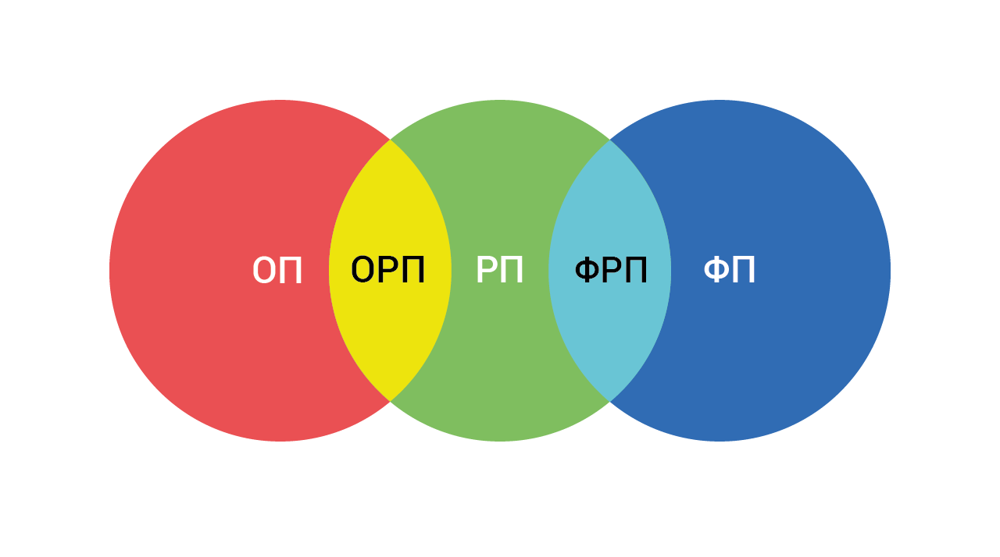
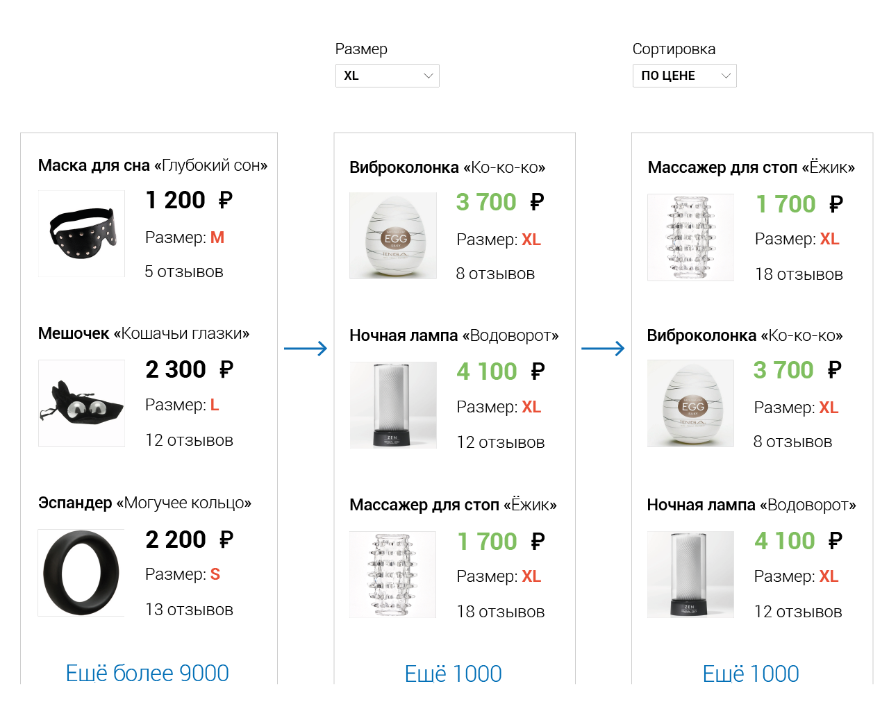
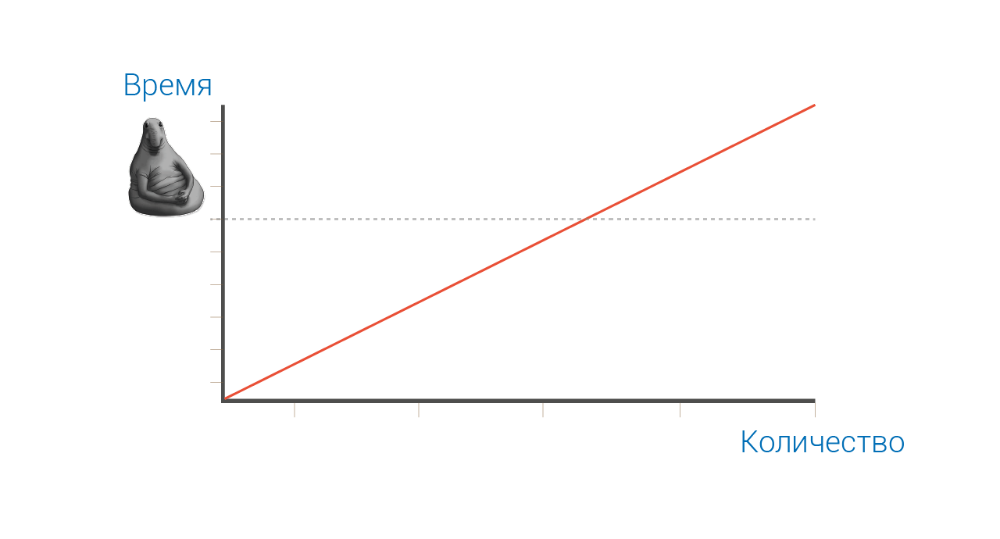
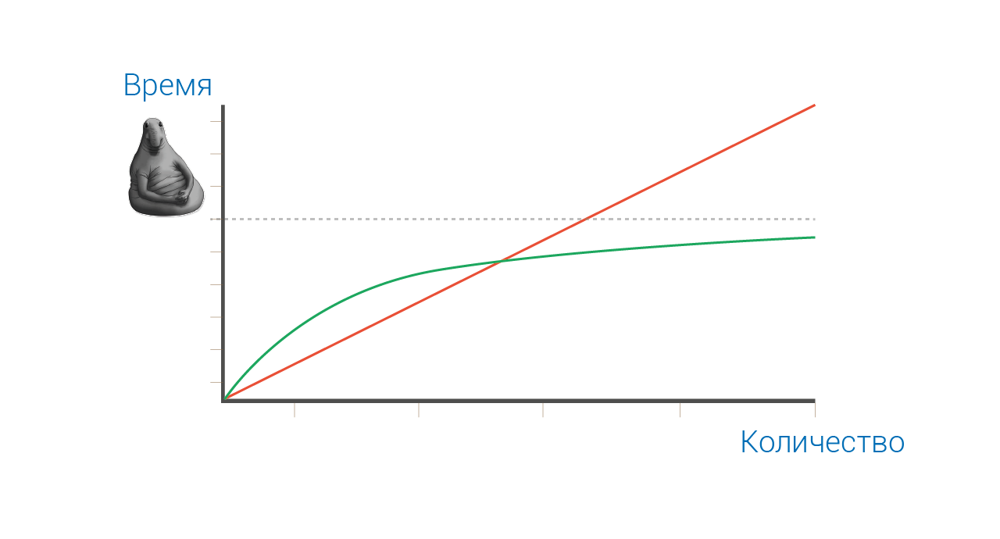
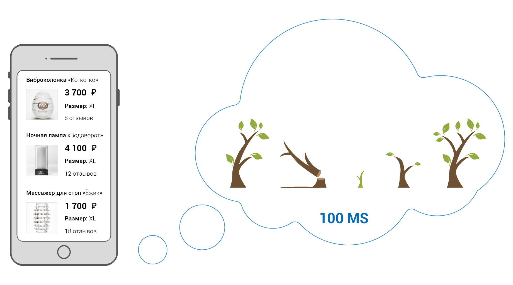

# Объектное Реактивное Программирование

**[Дмитрий Карловский](https://github.com/nin-jin/)** из **[SAPRUN](http://www.saprun.com)** представляет... м...


**[//nin-jin.github.io/slides/orp/](https://nin-jin.github.io/slides/orp/)**

# Рекламная пауза


> Всем привет, меня зовут Дмитрий Карловский. Я являюсь руководителем группы веб-разработки компании САПРАН. Компания наша является крупнейшим интегратором САП-а в России, но в последнее время мы активно смотрим в сторону разработки собственных программных продуктов. Конкретно наш департамент развивает платформу быстрой и безопасной доставки данных на мобильное устройство "HyperHive" и кроссплатформенный open source фреймворк быстрого построения отзывчивых интерфейсов "$mol", в котором мы по максимуму применяем возможности Объектного Реактивного Программирования, о которых я и расскажу далее...

# Термины

> **Итак, что такое Объектное Программирование?** Основной его чертой является объединение данных и функций для работы с ними в рамках одной абстракции с относительно простым интерфейсом - объекте.

> **А что такое Функциональное Программирование?** Тут вся программа описывается в виде кучи чистых функций, которые не зависят от изменяемого состояния и сами не изменяют никаких состояний.

> **Наконец, что такое Реактивное Программирование?** Здесь вы описываете правила получения одних состояний из других таким образом, что изменение одного состояния приводит к каскадному изменению зависимых.



> У многих Реактивное Программирование прочно ассоциируется с Функциональным, однако, оно куда ближе к Объектному, так как основные действующие лица в Реактивном Программировании - изменяемые состояния. И, хотя зависимости между состояниями зачастую описываются в виде функций, они вовсе не обязаны быть чистыми, но они должны быть идемпотентными, чтобы программа не крутилась в бесконечном цикле как белка в колесе.

# Каталог товаров

> Давайте представим, что мы решили открыть интернет-магазин по продаже игрушек. Причём сделать мы хотим всё не абы как, а стильно, модно, молодёжно, быстро, гибко и надёжно..


> Пусть у нас есть 10 000 игрушек. Мы можем загрузить все данные на клиентское устройство и быстро, без сетевых задержек, позволить пользователю просматривать каталог.

# Фильтрация

> Листать этот огромный каталог, конечно, интересно, но пользователю хотелось бы ограничить его лишь теми игрушками, что особенно интересуют его в данный момент. Поэтому мы добавляем фильтрацию. Отфильтровать игрушки можно по самым разным параметрам: по размеру, по цене, по рейтингу, по тексту в описании, да много по чему.


> Сложный фильтр на большие объёмы данных может накладываться довольно продолжительное время, поэтому нам бы не хотелось, чтобы фильтрация повторялась лишний раз. Ведь это приводит к снижению отзывчивости приложения, увеличению энергопотребления и вообще это совсем не круто.

# Сложная фильтрация

> Например, если мы отфильтровали по тексту в описании, то нет смысла перефильтровывать каталог, когда меняется рейтинг какой-либо игрушки. Но если мы отфильтровали по рейтингу, то перефильтрацию в этом случае мы сделать уже обязаны.


> Фильтры могут быть и более хитроумными, затрагивания разные свойства разных товаров, так что вручную следить за всеми подобными зависимостями довольно сложно: кода получается много, а что-то обязательно будет не учтено. Поэтому важно знать от каких конкретно свойств каких конкретно товаров зависит результат фильтрации, чтобы перезапускать его только при изменении тех состояний, что реально влияют на результат.

# Сортировка

> Пользователь обычно хочет просматривать игрушки не в произвольном порядке, а в каком-то конкретном. Например: в порядке увеличения цены или уменьшения релевантности. Поэтому он должен иметь возможность указать критерий сортировки, который опять же может затрагивать различные свойства товаров и быть достаточно тяжёлыми на больших списках.



> Очевидно, повторную сортировку нужно будет произвести лишь при изменении критерия сортировки... или тех свойств товаров, от которых зависит сортировка. Но не любых товаров, а лишь тех, что соответствуют критерию фильтрации. И, соответственно, при изменении самого этого критерия. И...

# Учёт всех зависимостей

> Если вы попытаетесь описать в коде все зависимости между всеми состояниями, то это приведёт к **комбинаторному взрыву** и вам оторвёт руки. 


> Поэтому без Реактивного Программирования вы не сможете сделать сколь-нибудь сложное приложение **быстрым**, **надёжным** и **компактным** одновременно.

# Всё ли рендерить?

> Если вы будете отображать все данные, что подготовили, то алгоритмическая сложность рендеринга будет пропорциональная объёму этих данных. 10 товаров рендерятся мгновенно, 1000 - с задержкой, а 10000 - уже несколько секунд.



# Или не всё?

> Если у пользователя такой экран, что одновременно в него влезает не более 10 игрушек, то визуально для него не будет никакой разницы - будете ли вы рендерить всю 1000 или только 10 из них. Поэтому, каким бы быстрым ни был у вас ~~React~~ шаблонизатор, он всегда будет проигрывать по отзывчивости ленивой архитектуре, которая в гораздо меньшей мере зависит от объёмов данных.



# Отображение лишь видимого

> Если высота каждой строки нам известна заранее, то, зная высоту окна, легко понять какие товары точно не видны, а какие может хоть краешком, но влезают в видимую область. Вырезать из огромного списка элементы с первого по десятый - плёвая операция. Но только, если этот список у нас хранится где-то в закешированном виде. Если же мы при скроллинге будем на каждый фрейм пересортировывать список, а то ещё и перефильтровывать его, то ни о какой плавности скроллинга не может идти и речи.


# Примерение изменений к DOM

> Ок, данные мы подготовили, осталось показать их пользователю. Решение в лоб - удалить старое дерево и вставить новое. Именно так работают почти все HTML-шаблонизаторы.



> К сожалению это слишком медленно. Кроме того, это сбрасывает динамические состояния узлов. Такие как: "позиция скроллинга", "позиция каретки" и другие. Реальность упорно не хочет быть чистой функцией - для повышения отзывчивости нужно по возможности изменять существующее состояние, а не просто создавать новое. А если не можешь победить - возглавь!

# Виртуальный DOM

> Как подружить ужа с ежом? Правильно, давайте генерировать новый DOM всего приложения, а потом ~~React~~ специальная библиотека будет сравнивать его новую и старую версию и применять различия к тому DOM-у что реально видит пользователь.


> Звучит как костыль, не правда ли? Посмотрите на схему - сколько работы приходится выполнять только лишь для того, чтобы, изменить значение текстового узла, когда в одной из моделей поменялось строковое свойство.

# Прямые зависимости

> Как могла бы выглядеть работа наиболее эффективного решения?


> Всё просто - между исходными данными и их отображением устанавливаются прямые связи. При изменении одного состояния, изменяется и зависимое от него. Причём действует это не только между так называемыми "моделью" и "отображением", а между любыми зависимыми состояниями, начиная с базы данных на сервере, через кучу промежуточных состояний и заканчивая дом-узлом в браузере. Именно в этом и заключается суть Реактивного Программирования, а не в шаблонизаторе с созвучным названием, который продают нам на каждой конференции.

# Так ли это всё важно?

> Вы можете сказать, что я сгущаю краски, а конкретно в вашем проекте никогда не будет столько данных, и тяжёлой их обработки, и открывать ваше приложение будут лишь на мощных рабочих станциях, а не на хилом китайском тапке в режиме энергосбережения.


# Треугольник серпинского на ReactJS@15

> Но на это у меня есть простое соображение. Для обеспечения плавности работы вашему приложению необходимо работать со скоростью в 60 кадров в секунду, что даёт всего 16 миллисекунд на все операции начиная с подготовки данных, и заканчивая пересылкой отрисованных областей в видеопамять. И превысить эти 16 миллисекунд очень просто даже в довольно простом приложении на довольно мощном компьютере.


> Перед вами демо созданное ребятами из Facebook, демонстрирующее, как сильно виртуальный DOM сказывается на плавности анимации в достаточно сложном приложении. Они это сейчас пытаются решить размазывая вычисления по кадрам, но фундаментальная проблема остаётся неизменной - виртуальный DOM требует кучи вычислений на каждый чих.

# Треугольник серпинского с использованием ОРП

> ОРП, напротив, позволяет минимизировать объём вычислений, оптимизируя потоки данных от их источника до потребителя.


> Как вы можете видеть, даже без размазывания вычислений по фреймам, нам удаётся показывать гораздо большую отзывчивость приложения. И всё это благодаря прямым реактивным связям между исходными данными и зависящих от них DOM-узлами.

# Пробуем толкать (ФРП)

> Есть два принципиально разных способа реализации реактивности.

> Первый - это всякие беконы, RX-ы и прочий стрим-панк, так же известный как Функциональное Реактивное Программирование. Суть его в том, что вы явным образом получаете так называемые стримы, от которых зависит ваше состояние и добавляете к ним функцию вычисления нового значения. Каждый стрим как бы проталкивает вычисленное им значение во все зависимые стримы, а что с этим значением делать или не делать они уже решают сами.

```typescript
const ToysSource = new Rx.BehaviorSubject( [] )
const Toys = ToysSource.distinctUntilChanged().debounce( 0 )

const FilterSource = new Rx.BehaviorSubject( toy => toy.count > 0 )
const Filter = FilterSource.distinctUntilChanged().debounce( 0 )

const ToysFiltered = Filter
.select( filter => {
	if( !filter ) return Toys
	return Toys.map( toys => toys.filter( filter ) )
} )
.switch()
.distinctUntilChanged()
.debounce( 0 )
```

> Посмотрите на этот FRP-ребус и попробуйте сходу сказать, что и зачем он делает. А делает он простую штуку: создаёт стрим отфильтрованных товаров таким образом, что если функция фильтрации не задана, то собственно фильтрации и не происходит. Тут уже применено несколько типовых оптимизаций. Тем не менее работает этот код очень не эффективно: если какой-либо фильтр задан, то список игрушек перефильтровывается всякий раз при любом изменении данных любой игрушки. Чтобы побороть эту проблему, нужно ещё на порядок усложнить код, но на это уже мало у кого хватит уситчивости.

> Данный подход приводит к сложному, трудноподдерживаемому коду. Его трудно читать. Его сложно писать. Его лень писать правильно. В нём легко допустить ошибку, если вы, конечно, не финалист специальной олимпиады по информатике.

# Нет, давайте тянуть! (ОРП)

> Куда проще и эффективней использовать другой подход, где вычисления начинаются не от источника данных, а от их потребителя.

```typescript
class $my_toys {

	@ $mol_mem()
	toys( next = [] ){ return next }

	@ $mol_mem()
	filter( next = toy => toy.count() > 0 ){ return next }

	@ $mol_mem()
	toys_filtered() {
		if( !this.filter() ) return this.toys()
		return this.toys().filter( this.filter() )
	}
}
```

> Не правда ли ORP код куда проще, и понятнее? Это тот же код, который мы бы написали безо всякого реактивного программирования, но мы добавили декоратор, который динамически отслеживает зависимости по факту обращения к ним, кеширует результат исполнения функции и сбрасывает кеш, когда зависимости изменяются.

> Правильная реализация логики этих декораторов позволяет производить вычисления наиболее оптимальным образом, не перекладывая головную боль по контролю потоков данных на прикладного программиста.

# Добавляем сортировку

> Далее у нас идёт отсортированный список товаров, зависящий от функции сортировки, которая по умолчанию сортирует по цене, а значит при изменении цены какой-либо игрушки из отфильтрованного списка, сортировка будет произведена вновь.

```typescript
@ $mol_mem()
toys_sorted() {
	return this.toys_filtered()
	.slice()
	.sort( this.sorter() )
}
```

```typescript
@ $mol_mem()
sorter( next = ( a , b )=> {
	return b.price() - a.price()
} ) { return next }
```

# Отображаем лишь видимое

> Ну и под конец, мы вырезаем лишь видимые сейчас на экране товары. При этом перемещение скроллинга приводит лишь к незначительному по времени повторному вырезанию видимых задач, без бессмысленных перефильтраций и пересоровок.

```
@ $mol_mem()
toys_visible() {
	return this.toys_sorted()
	.slice( ... this.view_window() )
}

sub_components() {
	return this.toys_visible()
}
```

# Реактивный рендеринг

> *Давайте реализуем теперь рендеринг компонента. При изменении имени игрушки, перезапущен будет лишь рендеринг карточки этой игрушки, а при изменении позиции скроллинга, появившиеся карточки будут отрендерины, а ушедшие из области видимости - по тихому уничтожены.*

```
@ $mol_mem()
render() {
	const node = document.getElementById( this.id() ) || document.createElement( 'div' )
	if( !node.id ) node.id = this.id()
	
	patch_node( node , this.attrs() , this.sub_components().map( comp => comp.render() ) )

	return node
}
```

> *Состояние dom-узла зависит от свойств компонента и от dom-узлов вложенных компонентов. Эта простая схема позволяет точечно обновлять DOM не производя лишних вычислений.*

# А если исключение?

> *Обычно исключения безвозвратно ломают приложение. Однако, исключение - такой же результат вычисления, как и собственно возвращаемое значение. Устранение причины исключения должно восстанавливать работу приложения.* 

> *Ошибки, ожидание загрузки и тп автоматически перехватываются и визуализируются. Это позволяет частям приложения падать и восстанавливать свою работу, не ломая других частей.* 

```
try {

	patch_node( node , this.attrs() , this.sub_components().map( comp => comp.render() ) )

	patch_node( node , { mol_view_error : null } )

} catch( error ) {

	console.error( error )

	patch_node( node , { mol_view_error : error.name } )
}
```

# Индикация ошибки

> *Временное отсутствие данных, пока они не загружены, - такая же исключительная ситуация, а раз мы не боимся исключаений, а умеем восстанавливать работу после устранения их причины, то это можно использовать для индикации ожидания данных.*

```
[mol_view_error] {
	background: red;
	color: white;
}

[mol_view_error="$mol_atom_wait"] {
	animation: my_waiting .25s steps(6) infinite;
}
```

# Загрузка: Синхронная блокирующая

> Давайте поговорим о загрузке данных. Взгляните на пример кода, который вычисляет сообщение о числе тёзок текущего пользователя. 

```
namesakes_message() {
	const user = this.user()
	const count = this.name_count( user.name )
	
	return this.texts().namesakes_message
	.replace( /\{count\}/g , count )
}
```

> Метод ```user``` делает запрос к серверу за информацией о пользователе, откуда берётся его имя и оно передаётся в метод ```names_count```, который запрашивает у другого сервера число пользователей с данным именем. Потом мы дёргаем метод ```texts```, чтобы получить тексты для текущей локали, берём оттуда нужный текст и подставляем в него полученное ранее число.

> Код простой и понятный, не правда ли? Но тут есть одна беда: пока выполняется каждый из этих трёх запросов всё приложение встаёт колом, так как виртуальная машина javascript однопоточная, а эти запросы блокируют поток до своего завершения.

# Загрузка: Асинхронная неблокирующая на Promise

> Чтобы решить проблему блокировки потока на время выполнения запроса в яваскрипте принято присать код на колбэках, в котором сам чёрт ногу сломит.

```
namesakes_message() {
	
	return Promise.all([
		this.user() ,
		this.texts() ,
	])
	.then( ([ texts , user ])=> {
		
		return this.name_count( user.name )
		.then( count => {
			
			return texts.namesakes_message
			.replace( /\{count\}/g , count )
			
		} )
		
	} )
	
}
```

> Обратите внимание, что тут мы грузим информацию о пользователе и тексты паралельно, так как они не зависят друг от друга. Это ускоряет общую загрузку всех ресурсов. Но поддерживать такой код - смерти подобно.

# Загрузка: Синхронная неблокирующая на async/await

> Недавно в яваскрипте появились средства синхронизации, но действуют они лишь в пределах одной функции, а не всего стека вызовов.

```
async namesakes_message() {
	
	const [ texts , user ] = await Promise.all([
		this.texts() ,
		this.user() ,
	])
	
	const count = await this.name_count( user.name )
	
	return texts.namesakes_message
	.replace( /\{count\}/g , count )
}
```

> Если мы пометили функцию как "асинхронную", то мы можем приостанавливать её до появления определённого события. Код снова становится простым и понятным, разве что для распараллеливания запросов нам всё ещё нужно кастовать специальные заклинания.

# Загрузка: Синхронная неблокирующая на атомах

> А что если я скажу вам, что следующий код не смотря всю на свою синхронность может быть не только неблокирующим, но и грузить информацию о пользователе и тексты параллельно? 

```
@ $mol_mem()
namesakes_message() {
	const texts = this.texts()
	const user = this.user()
	const count = this.namesakes_count( user.name )
	
	return texts.namesakes_message
	.replace( /\{count\}/g , count )
}
```

> Не без ограничений, но ОРП позволяет вам писать предельно простой и понятный код, при этом по максимуму используя возможности неблокирующих запросов. Вся магия в адекватной обработке исключительных ситуаций. Когда мы синхронно запрашиваем данные, а их нет - это самая натуральная исключительная ситуация для синхронного кода. Поэтому, кидается специальное исключение, которое останавливает текущий стек вызовов. Когда же данные придут, исполнение будет перезапущено и на этот раз данные уже будут возвращены. А чтобы добиться распараллеливания, реактивные свойства не пробрасывают исключение сразу, а возвращают прокси объект, который можно положить в переменную, куда-то передать, но при  попытке доступа к его содержимому - будет брошено сохранённое исключение. В данном примере, прерывание произойдёт при доступе к ```user```, ```texts``` и ```count```, если они ещё не загружены.

# Загрузка: Игрушки

> Давайте добавим неблокирующую загрузку списка игрушек, вместо локального его хранения. Для этого нам потребуется изменить всего один метод.

```
/// **Before**
@ $mol_mem()
toys(){ return [] }
```

```
/// **After**
@ $mol_mem()
toys() {
	const data = $mol_request.json( 'toys.json' )
	return data.map( id => this.toy( id ) )
}
```

> Как видите, нам не потребовалось менять интерфейс метода - мы просто взяли содержимое файла, как если бы оно было у нас локально, и обработали его.

# Движение данных

> Пока что мы говорили лишь про движение данных от сервера к пользователю. Однако, стоит обратить внимание и на обратный поток данных.


> На диаграмме, каждое звено - это некоторое состояние, выраженное в различных моделях. На бэкенде, например, дата у нас выражена числом в таблице. На фронтенде она уже представляется виджетом "календарик" в соответствующем состоянии. Ну а в голове у пользователя это просто "тот день, когда я выступал на конференции".

> Если опустить посредников, то можно заметить, что источником истины о том, что видит пользователь является бэкенд, а источником истины о том, что следует изменить на бэкенде, является пользователь. Но самое интересное происходит, когда мы добавляем посредников. Пример такого посредника - пользовательский интерфейс, состояние которого зависит и от сервера и от пользователя. Как же реализовать его так, чтобы работал он чётко и предсказуемо?

# Двунаправленные зависимости

> Что если пользователь будет менять то состояние, значение которого было сформировано на основе выдачи сервера? Получается у этого состояния будет два источника истины - пользователь и сервер. Поэтому вскоре мы обнаружим конфликт состояний вида "с одной стороны пришло 5 июня, а с другой - 6".


> На диаграмме вы можете заметить структуру связей в типичном приложении на Ангуляре. Цепочка состояний обычно длиннее, но для понимания проблемы хватит и 4. Когда пользователь меняет состояние, начинают срабатывать watcher-ы, которые итеративно синхонизируют состояния между собой, что приводит ко временной неконсистентности состояния приложения вцелом. Эта логика работы не эффективна и требует очень аккуратного написания кода, иначе всё будет скакать и прыгать. 

# "Однонаправленный" поток данных

> Facebook подумал-подумал и придумал FLUX, где поток от сервера к пользователю идёт через компоненты, а обратно - через глобальные процедуры - так называемые "Экшены". 


> Написание компонент стало относительно простой задачей, но только до тех пока, пока они лишь выводят информацию. Как только вы заходите, чтобы пользователь мог не только смотреть в ваше приложение, но что-то в нём изменять, у вас появляется обратный поток, идущий в обход компонентной иерархии, что создаёт проблемы с созданием переиспользуемых компонент. Проще говоря, вы не можете просто взять и использовать такой компонент, не реализовав для каждого места его использования набор отдельных глобальных процедур. Пол века назад эта проблема уже была решена за счёт абстракции и инкапсуляции, но до сих пор мы ходим по одним и тем же граблям.

# Двусторонние каналы

> Проблема двустороннего связывания Агнуляра была не в том, что оно двустороннее, а в том, что состояние сначало изменялось, а потом отложенно синхронизировалось. Причём меняться оно могло как с одной стороны, так и с другой. Именно в этом был корень всех проблем. Как же его выкорчавать? 

> Решение в Объектном Программировании существует уже не один десяток лет - не давать напрямую изменять состояние. Вместо этого доступ к состоянию реализуется через специальные функции - так зазываемые "акцессоры". Пользователь объекта может лишь изъявить желание поменять значение определённого свойства, а что с этим значением делать - объект уже решает сам.


> На диаграмме можно видеть, как новое значение передаётся от объекта к объекту не меняя их состояний. И только когда приходит ответ от сервера с актуальным значением, оно спускается по иерархии компонент. У этой архитектуры нет проблем Ангуляра с неконсистентностью, ведь прямой и обратный поток данных не перемешиваются. Но нет и проблем FLUX-а, так как каждый компонент взаимодействует лишь со своим непосредственным владельцем и непосредственным имуществом. Всё, что нужно, чтобы повторно использовать какой-либо компонент - это создать экземпляр и настроить его под себя, предоставив ему так называемые "свойства" - это своего рода двусторонние каналы, из которых можно затянуть актуальные данные и предложить новые.

# Композиция компонент: Абстракции

> В простейшем случае компонент - это экземпляр определённого класса. Интерфейс этого класса состоит из методов-акцессоров, они могут работать как с локальным состоянием, так и делегировать получение и изменение значения методам другого объекта.

```
class Input {
	
	@ $mol_mem()
	value( next = '' ) { return next }
	
	placeholder() { return '' }
	
	// ...
}
```

> Данный пример - строковое поле ввода. Для иллюстрации приведено два свойства: ```placeholder``` - это текст показываемый, если значение поля не задано; и ```value``` - это текущее значение. Когда пользователь вводит новое значение оно передаётся в value. Соответственно тут мы можем это значение как-то нормализовать, провалидировать, куда-то сохранить. В данном случае мы используем декоратор, чтобы значение ```value``` кешировалось локально в текущем объекте.

# Композиция компонент: Переопределение

> Чтобы настроить поведение компонента мы можем просто переопределить его свойства своими функциями. Например, можем сделать, чтобы ```placholder``` был известным персонажем комиксов.

```
const Name = new Input

Name.placeholder = ()=> 'Batman'
```

> Или можем попросить компонент в качестве ```value``` брать не своё локальное состояние, а нашу локальную переменную.

```
let name = 'Jin'

Name.value = ( next = name )=> {
	return name = next
}
```

> Тут мы просто говорим, что при *затягивании* из ```value``` нужно вернуть значение переменной ```name```, а при *проталкивании* - записывать в ```name``` и возвращать актуальное значение.

> Вам может показаться, что это дурнопахнущий код, так как мы берём и переопределяем любой метод стороннего объекта, но на практике это всё отлично работает и не доставляет проблем. Мы не можем записать левый метод или изменить сигнатуру метода, иначе тайпчекер настучит нам по башке. Единственное оганичение: компонент не должен ничего делать в своём конструкторе, а переопределять методы можно лишь один раз при создании объекта.

# Композиция компонент: Связывание

> Лучше всего, не создавать объекты в воздухе и не разбрасываться локальными переменными. Давайте реализуем компонент, который будет владеть нашим полем ввода и контролировать его жизненный цикл.

```
class Greeter extends $mol_view {
	
	@ $mol_mem()
	name( next = 'Annon' ) { return next }
	
	@ $mol_mem()
	hint( next = 'User name' ) { return next }
	
	@ $mol_mem()
	Name() {
		const next = new Input
		next.value = next => this.name( value )
		next.placeholder = ()=> this.hint()
		return next
	}
	
	// ...
}
```

> Тут мы используем реактивное свойство ```Name``` в качестве фабрики, которая лениво создаёт и настраивает компонент. Созданный компонент кешируется и при последующх обращениях к фабрике сразу возвращается. Кроме того, как только визуализация перестанет зависеть от этого компонента, кеш будет уничтожен вместе с компонентом ```Input```, что гарантирует нам правильное и своевременное освобождение занятых им ресурсов.

> Также, стоит обратить внимание, что интерфейс нашего компонента по преждему состоит из свойств, но при настройке вложенного компонента мы связываем наши свойства со свойствам поля ввода. Свойство ```placeholder``` фактически имеет односторонню связь со свойством ```hint```. Мы сможем его изменять, а поле ввода его изменить не сможет при всём желании. А вот ```value``` с ```name``` связаны двусторонне, так что поле ввода может и читать и писать в наше свойство ```name```.

# Композиция компонент: Прямая коммуникация

> Допустим у нас есть два компонента, которые знают друг о друге чуть менее, чем ничего. Например: поле ввода строки и поле вывода текста.

```
class Input extends $mol_view {
	
	@ $mol_mem()
	value( next = '' ) {
		return next
	}
	
	// ...
}

class Output extends $mol_view {
	
	text() {
		return ''
	}
	
	// ...
}
```

> Используя технику переопределния свойств мы можем провязать их друг с другом таким образом, что изменение текста в поле ввода будет тут же отражаться в изменении приветствия в поле вывода.

```
class Greeter extends $mol_view {
	
	@ $mol_mem()
	Name() {
		return new Input
	}
	
	@ $mol_mem()
	Message() {
		const next = new Output
		next.text = ()=> {
			return `Hello, ${ this.Name().value() }`
		}
		return next
	}
	
	// ...
}
```

> Но полученный нами компонент ```Greeter```, теперь стал вещью в себе, которую толком и не настроишь. Например, чтобы изменить приветствие, нужно будет переопределить всю фаблику ```Name```, скопипастив весь её код с минимальными изменениями. Поэтому стоит избегать создания сложных замыканий, предпочитая ему связывание свойств.

# Композиция компонент: Управляемая коммуникация

```
	@ $mol_mem()
	name( next ) {
		return next || 'Annon'
	}
	
	@ $mol_mem()
	Name() {
		const next = new Input
		next.value = next => this.name( value )
		return next
	}
```

```

	message() {
		return `Hello, ${ this.name() }`
	}
	
	@ $mol_mem()
	Message() {
		const next = new Output
		next.text = ()=> this.message()
		return next
	}
```

> В данном примере мы создаём в нашем компоненте два дополнительных свойства ```name``` и ```message```, которые уже тривиально связываем со свойствами вложенных компонент и друг с другом. Таким образом, тот, кто будет использовать наш ```Greeter``` сможет легко и просто настроить, например, значение имени по умолчанию или алгоритм формирования приветственного сообщения. Кода стало чуть больше, но он упростился по структуре, а использование этого компонента потребует меньше копипасты.

# Ложка дёгтя: Изменение собственной зависимости

```
@ $mol_mem()
increment() {
	this.value( this.value() + 1 )
}
```

> *Когда вам нужно изменить значение от которого вы зависите. Например - увеличить на 1. Красивого решения пока нет. Есть такое: для изменения запускать отдельную независимую реактивную задачу (самоуничтожающийся по завершении вычисления атом).*

```
increment() {
	$mol_atom_task( `${ this }.increment():1` , ()=> {
		
		const next = this.value() + 1
		
		$mol_atom_task( `${ this }.increment():2` , ()=> {
			this.value( next )
		}
		
	} )
}
```

```
increment() {
	$mol_atom_task( `${ this }.increment()` , ()=> {
		return this.value() + 1
	} ).then( next => {
		this.value( next )
	} )
}
```

# Реализации ОРП

* [$mol_mem](https://github.com/eigenmethod/mol/tree/master/mem)
* [VueJS](http://vuejs.org)
* [MobX](https://mobx.js.org)
* [CellX](https://github.com/Riim/cellx)
* [KnockOut](http://knockoutjs.com)

> Не гонитесь за хайпом. Мода переменчива и часто тащит нас в болото. Разумеется большой компанией выбираться из жопы интересней. Но если вы хотите вырваться вперёд, пока остальные буксуют, нужно учиться трезво и рационально оценивать технологии, выбирая те, что уменьшают сложность разработки, а не увеличивают её. Если ваш единственный аргумент - число разработчиков "знающих" технологию, то готовьтесь к тому, что через пару лет никто из них уже не захочет с ней связываться, а через 5 - вы не найдёте никого, кто смог бы разобраться в коде проекта.

# Вопросы?

**[//toys.hyoo.ru](http://toys.hyoo.ru)**


