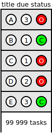
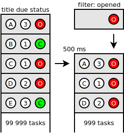
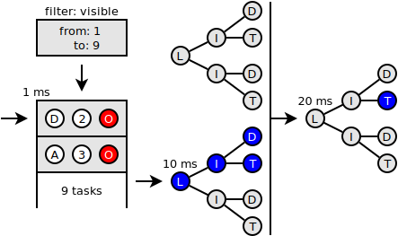
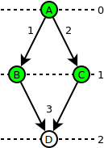
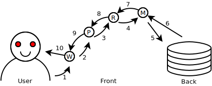

# Объектное Реактивное Программирование

* Автор: **[Дмитрий Карловский](https://github.com/nin-jin/)**
* Слайды: **[//nin-jin.github.io/slides/orp/](https://nin-jin.github.io/slides/orp/)**

> Привет всем землянам, меня зовут Дмитрий Карловский и я.. не буду строить из себя успешного разработчика и, прикрываясь крупной команией за плечами, продавать вам модную технологию, которая "решит все ваши проблемы". Доклад мой будет о незаслуженно непопулярной, но весьма элегантной парадигме и её удивительных возможностях.

> **Итак, что такое Объектное Программирование?** Основной его чертой является объединение данных и функций для работы с ними в рамках одной абстракции с относительно простым интерфейсом - объекте.

> **А что такое Функциональное Программирование?** Тут вся программа описывается в виде кучи чистых функций, которые не зависят от изменяемого состояния и сами не изменяют никаких состояний.

> **Наконец, что такое Реактивное Программирование?** Здесь вы описываете правила получения одних состояний из других таким образом, что изменение одного состояния приводит к каскадному изменению зависимых.

> У многих Реактивное Программирование прочно ассоциируется с Функциональным, однако, оно куда ближе к Объектному, так как основные действующие лица в Реактивном Программировании - изменяемые состояния. И, хотя зависимости между состояниями зачастую описываются в виде функций, они вовсе не обязаны быть чистыми, но они должны быть идемпотентными, чтобы программа не крутилась в бесконечном цикле как белка в колесе.

# Вся тяжесть зависимости

## Список задач

> Представьте, что вам надо реализовать менеджер задач. Причём не абы как, а стильно, модно, молодёжно, быстро, гибко и надёжно..
> Типичное число задач в аккаунте - порядка десятка тысяч, что позволяет нам выгрузить все данные на клиентское устройство и работать с ними без сетевых задержек.
> Но в некоторых долгоживующих аккаунтах число задач может доходить и до сотни тысяч, а в каждой задаче может быть до пары десятков полей с данными. По объёму это относительно много, но пользователь не против с утра немного подождать загрузки данных лишь бы потом всё летало.



> Тут у нас схематично изображён список из большого числа задач, для каждой из которых отмечено три свойства: название, оценка времени и статус "открыта/закрыта".

## Фильтрация

> Но обычно пользователю нужны не вообще все задачи, а только лишь их некоторая часть, соответствующая заданным критериям.



> В данном примере, мы оставили в списке лишь задачи со статусом "открытая", но реальные критерии могут быть самыми разнообразными и затрагивать разные поля задач, в том числе и разные поля у разных задач. Поэтому выполнение сложного фильтра на большом объёме данных может быть ощутимо продолжительной операцией, а значит чем реже нам потребуется её запускать, тем отзывчивее будет наше приложение.

> Тут, очевидно, повторная фильтрация нам потребуется в случае изменения критерия фильтрации, или изменении статуса одной из задач. Но если при изменении названия задачи мы будет перезапускать фильтрацию - это будут тормоза на ровном месте. Поэтому важно знать от каких конкретно свойств каких конкретно задач зависит результат фильтрации, чтобы перезапускать его только при изменении тех состояний, что реально влияют на результат.

## Сортировка

> Пользователю обычно нужно просматривать задачи не в произвольном порядке, а в каком-то конкретном. Поэтому он должен иметь возможность указать критерий сортировки, который опять же может затрагивать различные свойства задач и быть достаточно тяжёлыми на больших списках.


> Тут мы, для примера, добавили сортировку по сроку выполнения задачи. Очевидно, повторную сортировку нужно будет произвести лишь при изменении критерия сортировки... И срока исполнения, но не всех задач, а только если срок меняется у тех задач, что соответствуют критерию фильтрации... И, соответственно, при изменении самого этого критерия. И...

## Учёт всех зависимостей

> Если вы попытаетесь описать в коде все зависимости между всеми состояниями, то это приведёт к комбинаторному взрыву и вам оторвёт руки. 


> Поэтому без Реактивного Программирования мы не сможем сделать сколь-нибудь сложное приложение быстрым, надёжным и компактным одновременно.

> При этом важно, чтобы вычисления происходили в правильном порядке. Если мы пересортируем список, а потом перефильтруем его, то затем нам снова придётся сортировать, но уже новый результат фильтрации. Получается первую фильтрацию мы делали зря. А ведь это время, задержк и злой пользователь, крутящий мышью вокруг застывшей анимации.

> Вы можете сказать, что я сгущаю краски, а конкретно в вашем проекте никогда не будет столько данных, и тяжёлой их обработки, и открывать ваше приложение будут лишь на мощных рабочих станциях, а не на хилом китайском тапке в режиме энергосбережения.

> Но на это у меня есть простое соображение. Для обеспечения плавности работы вашему приложению необходимо работать со скоростью в 60 fps, что даёт всего 16 миллисекунд на все операции начиная с подготовки данных, и заканчивая пересылкой отрисованных областей в видеопамять. И превысить эти 16 миллисекунд очень просто даже в довольно простом приложении на довольно мощном компьютере.

## Отображение лишь видимого

> Если вы будете отображать все данные, что подготовили, то алгоритмическая сложность рендеринга будет пропорциональная объёму этих данных. 10 задач рендерятся мгновенно, 1000 задач рендерится с задержкой, а 10000 рендерятся уже пару секунд. Если у пользователя такой экран, что одновременно в него влезает не более 10 задач, то визуально для него не будет никакой разницы - будете ли вы рендерить всю 1000 или только 10 из них. Поэтому, каким бы быстрым ни был у вас ~~React~~ шаблонизатор, он всегда будет проигрывать по отзывчивости архитектуре с ленивым рендерингом, которая в гораздо меньшей мере зависит от объёмов данных.


> Если высота каждой строки нам известна заранее, то, зная высоту окна, легко понять какие задачи точно не видны, а какие может хоть краешком но влезают в видимую область. Вырезать из огромного списка элементы с первого по девятый - плёвая операция. Но только, если этот список у нас хранится где-то в закешированном виде. Если же мы при скроллинге будем на каждый фрейм пересортировывать список, а то ещё и перефильтровывать его, то у нас всё приложение встанет колом.

> К чему это я? А к тому, что красивая абстракция "DOM как чистая функция от состояния" течёт по швам. Для повышения отзывчивости необходимо вводить промежуточные состояния, которые будут кешировать результаты вычислений и отслеживать зависимости, чтобы при их изменении сбрасывался и кеш.

## Примерение изменений к DOM

> Ок, данные мы подготовили, осталось показать их пользователю. 


> Решение в лоб - удалить старое дерево и вставить новое - мало того, что медленное, так ещё и может вызывать глюки типа "потери фокуса", "сброс позициии скроллинга в 0" и тому подобные. Короче, реальность упорно не хочет быть чистой функцией - для повышения отзывчивости нужно изменять существующее состояние, а не просто создавать новое. А если не можешь победить - возглавь!

## Виртуальный DOM

> Как подружить ужа с ежом? Правильно, давайте генерировать новый DOM всего приложения, а потом ~~React~~ специальная библиотека будет сравнивать его новую и старую версию и применять различия к тому DOM-у что видит пользователь.



> Звучит как костыль, не правда ли? Посмотрите на схему - сколько работы приходится выполнять только лишь для того, чтобы, когда пользователь меняет имя задачи, оно тут же менялось и в отображаемом списке задач.

## Прямые зависимости

> Как могла бы выглядеть работа наиболее эффективного решения?


> Всё просто - между исходными данными и их отображением устанавливаются прямые связи. При изменении одного состояния, изменяется и зависимое от него. Причём действует это не только между так называемыми "моделью" и "отображением", а между любыми зависимыми состояниями, начиная с базы данных на сервере, через кучу промежуточных состояний и заканчивая дом-узлом в браузере. Именно в этом и заключается суть Реактивного Программирования, а не в шаблонизаторе с созвучным названием, который продают нам на каждой конференции.

# Отслеживание зависимостей

## Тянуть или толкать?

> Есть два принципиально разных способа реализации реактивности.

> Первый - это всякие беконы, RX-ы и прочий стрим-панк, так же известный как Функциональное Реактивное Программирование. Суть его в том, что вы явным образом получаете так называемые стримы, от которых зависит ваше состояние и добавляете к ним функцию вычисления нового значения. Каждый стрим как бы проталкивает своё значение во все зависимые стримы, а что с этим значением делать или не делать они уже решают сами.

```typescript
// **FRP** (RxJS)
const Greeting = Is_name_showing
.select( is_name_showing => {
	if( is_name_showing ) {
		return User_name
		.map( user_name => {
			return `Hello, ${ user_name }!`
		} )
	} else {
		return Rx.Observable.of( 'Hello!' )
	}
} )
.switch()
.distinctUntilChanged()
.debounce( 0 )
```

> Посмотрите на этот FRP-ребус и попробуйте сходу сказать, что и зачем он делает. А делает он правильное ветвление логики: в зависимости от флага ```Is_name_showing``` стрим ```Greeting``` либо зависит от стрима ```User_name``` либо не зависит. В последнем случае при изменении имени пользователя не будет происходить повторного вычисления приветствия.

> Данный подход приводит к сложному, трудноподдерживаемому коду. Его трудно читать. Его сложно писать. Его лень писать правильно. В нём легко допустить ошибку, если вы, конечно, не финалист специальной олимпиады по информатике.

> Поэтому куда проще и эффективней использовать другой подход, где вычисления начинаются не от источника данных, а от их потребителя. Если он обратился к какому-то изменяемому состоянию, то очевидно он от него зависит и должен быть пересчитан, когда то состояние изменится. Код в этом случае получается крайне простым, гибким и, не смотря на затраты на трекинг зависимостей во время исполнения, эффективным.

```typescript
// **ORP** (MobX)
@computed
get greeting() {
	if( this.is_name_showing ) {
		return `Hello, ${ this.user_name }!`
	} else {
		return 'Hello!'
	}
}
```

> Не правда ли ORP код куда проще, и понятнее? Это тот же код, который мы бы написали безо всякого реактивного программирования, но мы добавили декоратор, который трекает зависимости, кеширует результат исполнения функции и сбрасывает кеш, когда зависимости изменяются. Делает этот код ровно то же самое, что FRP версия: если при вычислении значения не произошло обращения к свойству ```user_name```, то при изменении этого свойства никаких пересчётов происходить не будет. А если в какой-то момент мы вдруг начнём обращаться к имени пользователя, то при его изменении теперь будет происходить пересчёт. Пока мы не перестанем к нему обращаться в последующих пересчётах, разумеется.

## Сразу или потом?

> Ок, с построением графа зависимостей разобрались. Осталось решить когда обновлять зависимые состояния.

> Решение в лоб - как только состояние изменилось - последовательно идём по зависимым состояниям и обновляем их. А по мере их обновления обновляем и зависимые от них и так далее, так далее, так далее. Именно так работает по умолчанию ORP библиотека [KnockOut](http://knockoutjs.com) и все FRP библиотеки, что я видел.

> К сожалению, не всё так просто и, действуя так, мы можем получить дичайшие тормоза в некоторых случаях.


> На иллюстрации вы видите простейшую структуру зависимостей, которая приводит к лишним вычислениям. Изменение состояния ```A``` привело к изменению состояния ```B```, что вызвало пересчёт состояния ```D```, но в этом пересчёте использовалось старое состояние ```C```, поэтому когда очередь доходит, наконец, и до ```C```, то мы вдруг выясняем, что ```D``` нужно снова обновлять.

> В сложном приложении таких ромбов может быть довольно много, что многократно уменьшает отзывчивость оного.

## По мере увеличения глубины?

> Решение, которое было реализовано в моей библиотеке [$jin.atom](https://habrahabr.ru/post/235121/), заключалось в том, чтобы для каждого состояния поддерживать актуальным значение его максимальной глубины. Таким образом все состояния раскладывались в отдельные слои, а обновление происходило от менее глубокого слоя к более глубокому, что гарантировало, что к моменту вычисления определённого состояния все его зависимости точно приняли актуальное значение.



> Работало это отлично и показывало хорошую производительность, но иногда приводило к странным исключениям и тупнякам на ровном месте. Например, когда ```D``` в зависимости от состояния ```B``` вдруг перестаёт обращаться к ```C```. Получается, мы зря пересчитали ```C```, но узнали мы об этом уже слишком поздно, когда вычисления дошли до ```D```. Живой пример - когда вы переходите между экранами приложения. Вместо того, чтобы просто удалить старый экран, он может начать обновляться соответственно изменению ссылки, и только потом уже он будет уничтожен. И вам повезёт, если это не вызовет никаких исключительных ситуаций, так как в ссылке может уже не оказаться нужного тому экрану идентификатора.

## В порядке создания?

> Автор [VueJS](http://vuejs.org) не стал заморачиваться и просто даёт каждому состоянию порядковый номер. Обновления состояний соответственно идут в порядке увеличения порядкового номера. Сначала это работает хорошо, но чем дольше работает ваше приложение тем в более случайном порядке происходит обновление состояний, порождая всё те же проблемы лишних пересчётов.

> *Также стоит разобрать: MobX, CellX, ReSelect* 

# Правильный алгоритм

> Как же гарантировать правильный порядок обновления состояний, ведь пока мы не актуализировали все зависимости обновлять зависимое состояние нет смысла, но пока не вычислишь зависимое состояние и не узнаешь актуальный набор зависимостей?

## Построение графа зависимостей

> *Все вычисления происходят лениво. Между состояниями динамически строится направленный ациклический граф зависимостей. Каждый узел знает кто от него зависит и от кого он зависит.*

## Каскадная инвалидация

> *Все зависимые узлы помечаются устаревшими, а косвенно зависимые - возможно устаревшими. Узел, от которого никто не зависит откладывается для последующего обновления.*

## Отложенный пересчёт

> *Перед обновлением каждый узел убеждается в актуальности зависимостей в том же порядке, в котором они вычислялись ранее. И если хоть одна из них изменилась - обновляется и сам.* 

## Покажите мне код!

> Вооружившись знаниями, давайте теперь попробуем описать наше приложение со списком задач, используя ОРП.

```typescript
@ $mol_mem()
tasks_all( next = [] ) {
	return next
}

@ $mol_mem()
filter( next = task => true ) {
	return next
}

@ $mol_mem()
tasks_filtered() {
	return this.tasks_all()
	.filter( this.filter() )
}
```

> Тут у нас есть: реактивный изменяемый список задач, функция фильтрации, которую тоже можно динамически менять, и отфильтрованный список, зависящий от первых двух. Как видно, функция фильтрации по умолчанию возвращает истину, а значит пока мы её не изменим, любые изменения в содержимом задач не будут приводить к повторной фильтрации.

> Далее у нас идёт отсортированный список задач, зависящий от функции сортировки, которая по умолчанию сортирует по сроку заверения задачи, а значит при изменения срока у какой-либо задачи из отфильтрованного списка, будет произведена пересортировка.

```typescript
@ $mol_mem()
tasks_sorted() {
	return this.tasks_filtered()
	.slice()
	.sort( this.sorter() )
}

@ $mol_mem()
sorter( next = ( a , b )=> {
	return b.due() - a.due()
} ) {
	return next
}

@ $mol_mem()
tasks_visible() {
	return this.tasks_sorted()
	.slice( ... this.view_window() )
}
```

> Ну и под конец, мы вырезаем лишь видимые сейчас на экране задачи. При этом перемещение скроллинга приводит лишь к незначительному по времени повторному вырезанию видимых задач, без бессмысленных перефильтраций и пересоровок.

## А если исключительная ситуация?

> *Обычно исключения безвозвратно ломают приложение. Однако, исключение - такой же результат вычисления, как и собственно возвращаемое значение. Устранение причины исключения должно восстанавливать работу приложения.* 

# Асинхронщина

## Синхронный блокирующий

> Взгляните на пример кода, который вычисляет сообщение о числе тёзок текущего пользователя. 

```
namesakes_message() {
	const user = this.user()
	const count = this.name_count( user.name )
	
	return this.texts().namesakes_message
	.replace( /\{count\}/g , count )
}
```

> Метод ```user``` делает запрос к серверу за информацией о пользователе, откуда берётся его имя и оно передаётся в метод ```names_count```, который запрашивает у другого сервера число пользователей с данным именем. Потом мы дёргаем метод ```texts```, чтобы получить тексты для текущей локали, берём оттуда нужный текст и подставляем в него полученное ранее число.

> Код простой и понятный, не правда ли? Но тут есть одна беда: пока выполняется каждый из этих трёх запросов всё приложение встаёт колом, так как виртуальная машина javascript однопоточная, а эти запросы блокируют поток до своего завершения.

# Асинхронный неблокирующий Promise

> Чтобы решить проблему блокировки потока на время выполнения запроса в яваскрипте принято присать код на колбэках, в котором сам чёрт ногу сломит.

```
namesakes_message() {
	
	return Promise.all([
		this.user() ,
		this.texts() ,
	])
	.then( ([ texts , user ])=> {
		
		return this.name_count( user.name )
		.then( count => {
			
			return texts.namesakes_message
			.replace( /\{count\}/g , count )
			
		} )
		
	} )
	
}
```

> Обратите внимание, что тут мы грузим информацию о пользователе и тексты паралельно, так как они не зависят друг от друга. Это ускоряет общую загрузку всех ресурсов. Но поддерживать такой код - смерти подобно.

## Синхронный неблокирующий async/await

> Недавно в яваскрипте появились средства синхронизации, но действуют они лишь в пределах одной функции, а не всего стека вызовов.

```
async namesakes_message() {
	
	const [ texts , user ] = await Promise.all([
		this.texts() ,
		this.user() ,
	])
	
	const count = await this.name_count( user.name )
	
	return texts.namesakes_message
	.replace( /\{count\}/g , count )
}
```

> Если мы пометили функцию как "асинхронную", то мы можем приостанавливать её до появления определённого события. Код снова становится простым и понятным, разве что для распараллеливания запросов нам всё ещё нужно кастовать специальные заклинания.

## Синхронный неблокирующий на атомах

> А что если я скажу вам, что следующий код не смотря всю на свою синхронность может быть не только неблокирующим, но и грузить информацию о пользователе и тексты параллельно? 

```
@ $mol_mem()
namesakes_message() {
	const texts = this.texts()
	const user = this.user()
	const count = this.namesakes_count( user.name )
	
	return texts.namesakes_message
	.replace( /\{count\}/g , count )
}
```

> Не без ограничений, но ОРП позволяет вам писать предельно простой и понятный код, при этом по максимуму используя возможности неблокирующих запросов.

# Обратный поток данных

## Движение данных

> Посмотрите на диаграмму взаимодействия пользователя с сервером через интерфейс приложения, где отмечены фундаментальные потоки данных.


> Каждое звено - некоторое состояние, выраженное в различных моделях. На бэкенде, например, дата у нас выражена числом в таблице. На фронтенде она уже представляется виджетом "календарик" в соответствующем состоянии. Ну а в голове у пользователя это просто "тот день, когда я выступал на конференции".

> Если опустить посредников, то можно заметить, что источником истины о том, что видит пользователь является бэкенд, а источником истины о том, что следует изменить на бэкенде, является пользователь. Но самое интересное происходит, когда мы добавляем посредников. Пример такого посредника - пользовательский интерфейс, состояние которого зависит и от сервера и от пользователя. Как же реализовать его так, чтобы работал он чётко и предсказуемо?

## Двунаправленные зависимости

> Что если пользователь будет менять то состояние, значение которого было сформировано на основе выдачи сервера? Получается у этого состояния будет два источника истины - пользователь и сервер. Поэтому вскоре мы обнаружим конфликт состояний вида "с одной стороны пришло 3 июня, а с другой - 4".


> На диаграмме вы можете заметить структуру связей в типичном приложении на Ангуляре. Цепочка состояний обычно длиннее, но для понимания проблемы хватит и 4. Когда пользователь меняет состояние, начинают срабатывать wotcher-ы, которые итеративно синхонизируют состояния между собой, что приводит ко временной неконсистентности состояния приложения вцелом. Эта логика работы не эффективна и требует очень аккуратного написания кода, иначе всё будет скакать и прыгать. 

## "Однонаправленный" поток данных

> Facebook подумал-подумал и придумал FLUX, где поток от сервера к пользователю идёт через компоненты, а обратно - через глобальные процедуры - так называемые "Экшены". 


> Написание компонент стало оносительно простой задачей, но только до тех пок, пока они только выводят информацию. Как только вы заходите, чтобы пользовател мог не только смотреть в ваше приложение, но что-то в нём изменять, у вас появляется обратный поток, идущий в обход компонентной иерархии, что создаёт проблемы с созданием переиспользуемых компонент. Проще говоря, вы не можете просто взять и использовать такой компонент, не реализовав для каждого места его использования набор отдельных глобальных процедур. Пол века назад эта проблема уже была решена за счёт абстракции и инкапсуляции, но до сих пор мы ходим по одним и тем же граблям.

## Изменяемые свойства как абстракция

> Проблема двустороннего связывания Агнуляра была не в том, что оно двустороннее, а в том, что состояние сначало изменялось, а потом отложенно синхронизировалось. Именно в этом был корень всех проблем. Как же его выкорчавать? 

> Решение в Объектном Программировании существует уже не один десяток лет - не давать напрямую изменять состояние. Вместо этого доступ к состоянию реализуется через специальные функции - так зазываемые "акцессоры". Пользователь объекта может лишь изъявить желание поменять значение определённого свойства, а что с этим значением делать - объект уже решает сам.



> На диаграмме можно видеть, как новое значение передаётся от объекта к объекту не меняя их состояний. И только когда приходит ответ от сервера с актуальным значением, оно спускается по иерархии компонент. У этой архитектуры нет проблем Ангуляра с неконсистентностью, ведь прямой и обратный поток данных не перемешиваются. Но нет и проблем FLUX-а, так как каждый компонент взаимодействует лишь со своим непосредственным владельцем и непосредственным имуществом. Всё, что нужно, чтобы повторно использовать какой-либо компонент - это создать экземпляр и настроить его под себя, предоставив ему так называемые "свойства" - это своего рода двусторонние каналы, из которых можно затянуть актуальные данные и предложить новые.

# Композиция компонент

## Абстракции

> В простейшем случае компонент - это экземпляр определённого класса. Интерфейс этого класса состоит из методов-акцессоров, они могут работать как с локальным состоянием, так и делегировать получение и изменение значения методам другого объенкта.

```
class Input {
	
	@ $mol_mem()
	value( next = '' ) { return next }
	
	placeholder() { return '' }
	
	// ...
}
```

> Данный пример - строковое поле ввода. Для иллюстрации приведено два свойства: ```placeholder``` - это текст показываемый если значение поля не задано; и ```value``` - это текущее значение. Когда пользователь вводит новое значение оно передаётся в value. Соответственно тут мы можем это значение как-то нормализовать, провалидировать, куда-то сохранить. В данном случае мы используем декоратор, чтобы значение ```value``` кешировалось локально в текущем объекте.

## Переопределение

> Чтобы настроить поведение компонента мы можем просто переопределить его свойства своими функциями. Например, можем сделать, чтобы ```placholder``` был известным персонажем комиксов.

```
const Name = new Input

Name.placeholder = ()=> 'Batman'
```

> Или можем попросить компонент в качестве ```value``` брать не своё локальное состояние, а нашу локальную переменную.

```
let name = 'Jin'

Name.value = ( next = name )=> {
	return name = next
}
```

> Тут мы просто говорим, что при "затягивании" нужно вернуть значение переменной ```name``, а при "проталкивании" - записывать в ```name``` и возвращать актуальное значение.

> Вам может показаться, что это дурнопахнущий код, так как мы берём и переопределяем любой метод, но на практике это всё отлично работает и не доставляет проблем. Мы не можем записать левый метод или изменить сигнатуру метода извне, иначе тайпчекер настучит нам по рукам. Единственное оганичение: компонент не должен ничего делать в своём конструкторе, а переопределять методы можно лишь один раз при создании объекта.

## Связывание

> Лучше всего, не создавать объекты в воздухе и не разбрасываться локальными переменными. Давайте реализуем компонент, который будет владеть нашим полем ввода и контролировать его жизненный цикл.

```
class Greeter extends $mol_view {
	
	@ $mol_mem()
	name( next = 'Annon' ) { return next }
	
	@ $mol_mem()
	hint( next = 'User name' ) { return next }
	
	@ $mol_mem()
	Name() {
		const next = new Input
		next.value = next => this.name( value )
		next.placeholder = ()=> this.hint()
		return next
	}
	
	// ...
}
```

> Тут мы используем реактивное свойство ```Name``` в качестве фаблики, которая лениво создаёт и настраивает компонент. Созданный компонент кешируется и при последующх обращениях к фабрике сразу возвращается. Кроме того, как только визуализация перестанет зависеть от этого компонента, кеш будет уничтожен вместе с компонентом ```Input```, что гарантирует нам правильное и своевременное освобождение занятых им ресурсов.

> Кроме того, стоит обратить внимание, что интерфейс нашего компонента по преждему состоит из свойств, но при настройке вложенного компонента мы связываем наши свойства со свойствам поля ввода. Свойство ```placeholder``` фактически имеет односторонню связь со свойством ```hint```. Мы сможем его изменять, а поле ввода его изменить не сможет при всём желании. А вот ```value``` с ```name``` связаны двусторонне, так что поле ввода может и читать и писать в наше свойство ```name```.

## Прямая коммуникация

> Допустим у нас есть два компонента, которые знают друг о друге чуть менее, чем ничего. Например: поле ввода строки и поле вывода текста.

```
class Input extends $mol_view {
	
	@ $mol_mem()
	value( next = '' ) {
		return next
	}
	
	// ...
}

class Output extends $mol_view {
	
	text() {
		return ''
	}
	
	// ...
}
```

> Используя технику переопределния свойств мы можем провязать их друг с другом таким образом, что изменение текста в поле ввода будет тут же отражаться в изменении приветствия в поле вывода.

```
class Greeter extends $mol_view {
	
	@ $mol_mem()
	Name() {
		return new Input
	}
	
	@ $mol_mem()
	Message() {
		const next = new Output
		next.text = ()=> {
			return `Hello, ${ this.Name().value() }`
		}
		return next
	}
	
	// ...
}
```

> Но полученный нами компонент ```Greeter```, теперь стал вещью в себе, которую толком и не настроишь. Например, чтобы изменить приветствие, нужно будет переопределить всю фаблику ```Name```, скопипастив весь её код с минимальными изменениями. Поэтому стоит избегать создания сложных замыканий, предпочитая ему связывание свойств.

## Управляемая коммуникация

```
	@ $mol_mem()
	name( next ) {
		return next || 'Annon'
	}
	
	@ $mol_mem()
	Name() {
		const next = new Input
		next.value = next => this.name( value )
		return next
	}
```

```	
	message() {
		return `Hello, ${ this.name() }`
	}
	
	@ $mol_mem()
	Message() {
		const next = new Output
		next.text = ()=> this.message()
		return next
	}
```

> В данном примере мы создаём в нашем компоненте два дополнительных свойства ```name``` и ```message```, которые уже тривиально связываем со свойствами вложенных компонент и друг с другом. Таким образом, тот, кто будет использовать наш ```Greeter``` сможет легко и просто настроить, например, значение имени по умолчанию или алгоритм формирования приветственного сообщения. Кода стало чуть больше, но он упростился по структуре, а использование этого компонента наоборот только упростится.

## Реактивный рендеринг

> *Состояние dom-узла зависит от свойств компонента и от dom-узлов вложенных компонентов. Эта простая схема позволяет точечно обновлять DOM не производя лишних вычислений.*

## Исключительные ситуации

> *Ошибки, ожидание загрузки и тп автоматически перехватываются и визуализируются. Это позволяет частям приложения падать и восстанавливать свою работу, не ломая других частей.* 

# Ложка дёгтя

## Императивное изменение зависимости

```
@ $mol_mem()
increment() {
	this.value( this.value() + 1 )
}
```

> *Когда вам нужно изменить значение от которого вы зависите. Например - увеличить на 1. Красивого решения пока нет. Есть такое: для изменения запускать отдельную независимую реактивную задачу (самоуничтожающийся по завершении вычисления атом).*

```
increment() {
	$mol_atom_task( `${ this }.increment():1` , ()=> {
		
		const next = this.value() + 1
		
		$mol_atom_task( `${ this }.increment():2` , ()=> {
			this.value( next )
		}
		
	} )
}
```

```
increment() {
	$mol_atom_task( `${ this }.increment()` , ()=> {
		return this.value() + 1
	} ).then( next => {
		this.value( next )
	} )
}
```

# Резюме

> Не гонитесь за хайпом. Мода переменчива и часто тащит нас в болото. Разумеется большой компанией выбираться из жопы интересней. Но если вы хотите вырваться вперёд, пока остальные буксуют, нужно учиться трезво и рационально оценивать технологии, выбирая те, что уменьшают сложность разработки, а не увеличивают её. Если ваш единственный аргумент - число разработчиков "знающих" технологию, то готовьтесь к тому, что через пару лет никто из них уже не захочет с ней связываться, а через 5 - вы не найдёте никого, кто смог бы разобраться в коде проекта.

# Вопросы?
